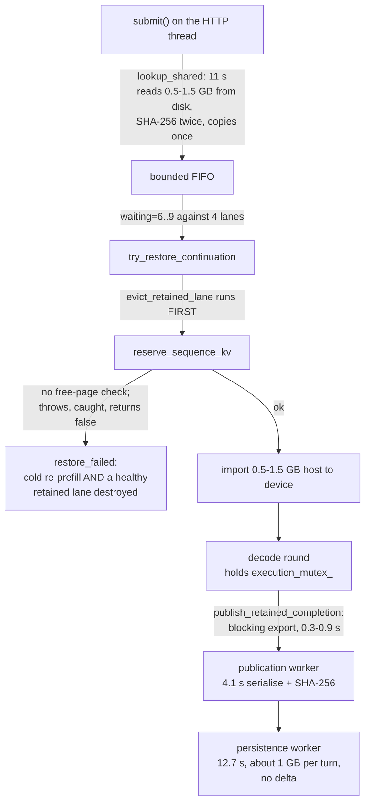

# Continuation cache and concurrency rework — 2026-08-22

Temporary dated plan. It tracks one active work item: making the tiered continuation cache and the
concurrent scheduler deliver low TTFT for concurrent agentic clients (OpenCode with subagents).
Stable conclusions move into [`../continuation-cache.md`](../continuation-cache.md),
[`../serving.md`](../serving.md),
[`concurrent-inference-architecture.md`](concurrent-inference-architecture.md), and
[`../performance.md`](../performance.md); this file is deleted when the work lands.

## 1. Problem

TTFT is the primary metric, decode throughput second. The tiered cache exists so that a session
whose GPU state has been displaced can be restored from a nearer tier instead of re-prefilling.
Under real concurrent OpenCode load it does not achieve that.

### 1.1 Measured baseline

`ninfer-serve` on RTX 4090 / `sm_89`, `models/qwen3_8_27b.ninfer`, `rk4v4-e8` KV,
`--max-concurrency 4`, `--max-context 262144`, `--kv-capacity 262144`, `--spec mtp`,
`--continuation-cache l1-l2-l3` (6144 / 16384 / 49152 MiB), `--prefix-checkpoint-history 4`.
Workload: one interactive OpenCode session that launched ten subagents, 154 completed requests over
roughly one hour. Sources: `/metrics` and the console request log.

| Metric | Value |
|---|---|
| TTFT p50 / p90 / max | 27.2 s / 50.3 s / 67.0 s |
| Requests that fully re-prefilled (`reuse=full_reset`) | 55 / 156 (35%) |
| …attributed to `restore_failed` | 29 |
| `continuation_restore_failures_total` | 51 |
| `continuation_publication_failures_total` | 56 of 183 (31%) |
| Foreground L3 lookup | 165.3 s over 15 operations = 11.0 s each, yielding 2 restores |
| L2 admission | 750.9 s over 183 operations = 4.1 s each |
| L3 persistence | 1397 s over 110 operations = 12.7 s each |
| L1 evictions / demotions | 89 / 62 |
| L2 occupancy | 15.5 GiB of 16 GiB, 19 entries |
| L3 occupancy | 47.7 GiB of 48 GiB, 49 entries |
| Scheduler | `waiting=6..9` against 4 lanes; `avg_decode_batch` 1.2–3.8 |

Reference request (`req 62`): 10,681 prompt tokens, 9,567 restored from L2, 1,114 to prefill.
Necessary work is about 0.75 s (0.31 s restore + 0.06 s preflight + 0.37 s prefill). Observed TTFT
was 28.3 s — a factor of 38.

### 1.2 Image size, measured and derived

A continuation image is `18,496 B/token` of paged KV (16 text layers x 1,088 B + 1 MTP layer x
1,088 B, quantised to 64-token pages) **plus a flat 153.94 MB per GDN snapshot**
(48 GDN layers x (`[10240,3]` BF16 conv + `[128,128,48]` FP32 recurrent)). An image that carries a
turn checkpoint stores the GDN snapshot twice, so the fixed term is 307.9 MB. At 9,567 tokens the
fixed term is 63% of the image; the FP32 recurrent matrices are 98% of the fixed term.

Every tier operation is O(full image): device-to-host export, host repack, SHA-256, serialise,
chunk, `fsync`, read-back, verify, host-to-device import. There is no delta path — `parent_id` is
only a compare-and-swap guard and is never used to reconstruct bytes.

### 1.3 Root causes



1. **`restore_failed` causes a cold re-prefill and destroys a second session.**
   `try_candidate` calls `evict_retained_lane(lane)` before `import_continuation_lane`. The import
   calls `reserve_sequence_kv` with no free-page check; when the shared paged-KV pool is short,
   `reserve_paged_kv_bundle` throws, the catch-all returns `false`, and the request cold-prefills
   with the evicted lane already gone.
2. **Synchronous L3 materialisation on the caller's thread.** `submit()` looks up the routed head
   and the stable alias with `include_history=false`, which materialises the image. From L3 that is
   an 11 s disk read plus two full SHA-256 passes, before the request is queued. The routed-history
   path already does metadata-first preflight; the single-head path does not.
3. **Bulk device-to-host export inline on the engine thread**, under `execution_mutex_`, inside the
   decode round, for every completion and every L1 demotion.
4. **Redundant full-image passes**: a second whole-image SHA-256 on L3 restore, a full copy in
   `promote_image`, a full repack in `Writer::blob`, and a stage-plus-`fsync` for chunks that
   already exist.
5. **The serialised byte order defeats chunk dedup.** `prefix_identity` grows 17 B/token and is
   emitted before the KV segments, so every turn shifts all downstream bytes and desynchronises
   every 4 MiB chunk boundary.
6. **Tier and history sizing.** `--prefix-checkpoint-history 4` multiplies aliases fourfold; both
   L2 and L3 ran full.
7. **Diagnosis was not possible from the logs.** There is no queue-wait field, the restore failure
   cause is discarded, `NoAlias` is the default miss reason on both constructor branches, `NoLane`
   is never emitted, and the routing hint is not recorded.

## 2. Contract changes

- The continuation image binary format moves from version 2 to version 3
  (`NICIMG02` to `NICIMG03`, manifest `NICMAN04` to `NICMAN05`). Per the repository's compatibility
  rules this is a project-owned format with no backward compatibility; the existing L3 tree is
  removed as part of the change.
- The structured request log schema moves from 12 to 13.
- `Program::import_continuation_lane` returns a status instead of `bool`.

## 3. Work

### Phase 0 — measurement infrastructure

**0.1 OpenCode swarm harness** — `tools/bench/opencode_swarm.py`, fixture under
`tools/bench/fixtures/swarm-repo/`.

Launches N concurrent headless `opencode run --auto --format json --agent <a> --model
ninfer-4090/qwen3.8-27b --dir <fixture>` processes against a committed, deterministic fixture repo
so prompt token counts are reproducible. Scenario phases, independently selectable:

| Phase | Exercises |
|---|---|
| `cold` | N fresh sessions sharing a system/tools prefix: stable-prefix reuse and the single-flight |
| `steady` | multi-turn tool loops: L1 append and turn checkpoints |
| `evict` | more sessions than lanes: L1 eviction into L2 restore |
| `restart` | server restart, then `--session <id>` resume: L3 restore |
| `lora` | interleaved base and adapter models: adapter alias isolation |

Correlates the OpenCode JSON event stream with `--request-log-jsonl` and reports TTFT p50/p90/p99,
decode tok/s, cache-source distribution, miss-reason histogram, `full_reset` rate, queue seconds,
and SM clock/power (the prefill throttling hazard in `../performance.md`).

**0.2 Instrumentation** (request log schema 13)

- `timings_seconds.queue` — submission to admission. The missing number that explains a 27 s TTFT.
- `timings_seconds.restore` — promoted into the timings block.
- `request.prompt_cache_key_digest` and `request.adapter` — needed to determine whether OpenCode
  reuses one `prompt_cache_key` across concurrent subagents, which would explain the publication
  CAS failures.
- `continuation_cache.restore_failure_reason` — `import_continuation_lane` returns a status
  (`KvReservationExhausted`, `VerifyDepthMismatch`, `SegmentInventoryMismatch`, `DecodeFailed`, …)
  instead of discarding the cause.
- Split the default miss reason into `NoAlias` and `NotAttempted`; emit `NoLane` under lane
  pressure; delete the write-only `restore_successes` / `restored_tokens` / `restored_bytes`
  counters; count 429 and 503 admission rejections.

### Phase 1 — correctness: stop the re-prefills

1. **Never destroy a retained lane before a restore is known to succeed.** Reorder to preflight,
   reserve KV, import into the fresh reservation, then release the previous occupant.
2. **Check free KV pages before committing.** `PagedKVCache::free_pages()` already exists. Prefer a
   lane whose eviction frees enough pages; otherwise fall through to the next candidate or the
   stable prefix instead of failing into a cold prefill.
3. **Reserve with the plan's entitlement**, not the bare frontier page count, so a restored lane
   does not have to grow immediately.
4. **Publication CAS.** Once 0.2 shows whether subagents share a `prompt_cache_key`: either re-read
   the head at publish time and chain onto it when the prefix is still an ancestor, or derive the
   alias from adapter, client key, and stable-prefix digest so divergent branches get distinct
   aliases instead of contending for one.

### Phase 2 — latency: bulk I/O off the critical paths

1. **Metadata-first lookup on the single-head path.** Compare the 32-byte prefix digests before
   materialising, and materialise on the engine worker, never on the caller's thread.
2. **Asynchronous device-to-host export.** Copies on a dedicated continuation stream into pinned
   host buffers, gated by a CUDA event that the publication worker waits on; the lane carries an
   export-in-flight flag so it cannot be re-admitted until the copy lands. Applies to completion
   publication, L1 demotion, and the stable-prefix export inside the prefill loop.
3. **Remove redundant full-image passes**: the whole-image SHA-256 on L3 restore (chunks are
   already content-verified), the `serialize()` copy in `promote_image`, the `Writer::blob` repack,
   and the stage-plus-`fsync` of chunks that already exist.

### Phase 3 — image format v3

1. **Re-order the serialised stream** so append-only, byte-stable data comes first and growing or
   mutating data last: framing, compatibility key, `main.text_kv`, `mtp.kv`, `main.gdn`,
   `checkpoint.gdn`, hidden regions, `prefix_identity`, metadata, digests.
2. **Align chunk boundaries to KV page multiples**, so a turn that appends 500 tokens writes about
   10 MB instead of about 1.2 GB.
3. **Deduplicate `checkpoint.gdn` against `main.gdn`** when the turn checkpoint sits at the
   frontier; store one segment and a reference. Saves 146.8 MiB on a large fraction of images.
4. **Evaluate BF16 storage for the GDN recurrent state.** This is a semantic boundary change, not a
   free implementation choice: FP32 GDN state is in the repository's numerical risk map. Gated on an
   independent FP64 oracle over a real multi-turn restore; dropped if the criterion fails.
5. **Version bump** and removal of the stale L3 tree.

### Phase 4 — tuning by measurement

Holding 262,144 context on 4 lanes, sweep on the harness and select on TTFT p50/p90:
`--prefix-checkpoint-history` (1, 2, 4), `--continuation-cache-l1-mib`, `-l2-mib`, `-l3-mib`
(re-derived from measured bytes per image once Phase 3 lands),
`--continuation-cache-persist-min-tokens` (8192, 16384, 32768), `--prefill-chunk` (512, 1024,
2048), `--max-pending-requests` (8, 16), `--prefix-checkpoint-policy`, and `--max-concurrency`
(4, 5, 6) re-measured only after Phases 1–3.

`--request-log-jsonl` must be part of the launch command; it is the only structured source for
these numbers.

## 4. Verification

| Change | Evidence |
|---|---|
| restore/publish round trip | existing numerical oracle at real shapes; a restored multi-turn session satisfies the observable contract, not token equality with a cold prefill |
| format v3 | `tests/test_continuation_cache.cpp`: v3 framing, and a chunk-stability assertion that turn N+1 shares at least 90% of the common-prefix chunks with turn N |
| restore under KV pressure | new test: a restore that cannot reserve pages leaves the retained lane intact and reports a specific reason |
| serving contracts | `tests/test_request_log.cpp` (schema 13), `tests/test_serve_metrics.cpp` (new counters) |
| end to end | the swarm harness, same fixture and prompts, before and after |

## 5. Acceptance criteria

1. `continuation_restore_failures_total` and `continuation_miss_restore_failed_total` are 0 under
   the standard swarm.
2. `reuse=full_reset` occurs only for genuinely cold sessions with no shared stable prefix.
3. No foreground L3 lookup above 100 ms, and no L3 materialisation on an HTTP thread.
4. L3 bytes written per turn scale with appended tokens, not with total tokens.
5. Publication failure rate below 2%.
6. TTFT p50 below 5 s and p90 below 12 s on the ten-subagent scenario, with decode tok/s not
   regressed.

## 6. Checkpoint A — measured after Phase 0, 1.1–1.3, and 2.1

Same hardware and server configuration as the baseline in 1.1, except `--max-pending-requests 32`
and `--request-log-jsonl`. Driver: `tools/bench/opencode_swarm.py --scenario cold,steady,evict
--sessions 8 --evict-sessions 12`, 52 OpenCode turns, 204 server requests, L3 tree emptied first.
GPU ended at 2625 MHz and 50 °C, so no thermal or power throttling contaminated the result.
Report: `profiles/bench/swarm-checkpoint-a.json`.

| Metric | Baseline | Checkpoint A |
|---|---|---|
| `continuation_restore_failures_total` | 51 | **12** |
| …attributable to a specific cause | no | **12 / 12 `kv_reservation_exhausted`** |
| `full_reset` share | 35% | 24.5% |
| Foreground L2 lookup | part of the 11 s L3 path | **4 µs** |
| Foreground L3 lookup | 11.0 s × 15 | 8.7 s × 25 |
| L2 admission | 4.1 s × 183 | 3.0 s × 224 |
| L3 persistence | 12.7 s × 110 | 8.1 s × 139 |
| Publication failures | 56 / 183 (31%) | 50 / 224 (22%) |
| `avg_decode_batch` | 1.2–3.8 | 3.8–4.0 |
| TTFT p50 / p90 | 27.2 s / 50.3 s | 31.5 s / 84.1 s |
| decode tok/s p50 | — | 56.4 |

Phase 1 achieved what it was for: five of the six restore-failure classes are now zero, and the
survivors are a single named cause rather than an unattributable `restore_failed`. Phase 2.1 made
the stable-prefix lookup free. TTFT did not improve, because the swarm applies more concurrent load
than the baseline session did, and because the actual cause of TTFT was not any of the above.

### 6.1 What the instrumentation revealed

`queue_seconds_total` is 9,080 s over 204 admitted requests: **a mean of 44.5 s of queueing against
a mean TTFT of 47.3 s.** Roughly 94% of TTFT is a request waiting for a lane. Prefill runs at
2,570 tok/s and restores cost milliseconds; neither is the problem. Two things reduce queueing:
more lanes, and returning each lane to the pool sooner.

The second is where the remaining defects concentrate, and they share one cause. L2 holds
**17 entries in 16.95 GiB — 997 MB per image**, because every publication serializes the whole
lane from token 0: full paged text KV, a 153.94 MB FP32 GDN snapshot, and a second 153.94 MB GDN
snapshot whenever a turn checkpoint exists. That single fact explains the rest:

- a newly admitted image is often the lowest-scoring entry in a full L2, so `evict_l2` discards it
  immediately, `store_impl` returns `stored=false`, and the publication is recorded as a hard
  failure whose session alias never advances — the next turn then has nothing to restore and takes
  `full_reset`;
- one `publication_loop` thread performs 224 admissions at 3.0 s and queues 139 persistences at
  8.1 s, about 1,811 s of serial work inside a 3,000 s run, so the queue backs up and stale
  publications are executed at full cost before failing;
- L3 lookup still materializes ~1 GB in the foreground at 8.7 s while holding a lane.

Image size is therefore not a Phase 3 refinement; it is the upstream cause of the publication
failures, the tier costs, and the residual `full_reset` rate. Phase 2.2/2.3 and Phase 3 are the
work that reduces queueing, and the Phase 4 lane sweep is only meaningful after them, because
`kv_reservation_exhausted` shows that KV capacity per lane is already the binding constraint at
four lanes.

### 6.2 Defect found by the checkpoint

`complete_success` computed `timings.queue_seconds` and was then overwritten wholesale by
`result.timings = generation_timings_lane(lane)`, so every per-request `queue` in the log read 0.0
while the aggregate counter was correct. The engine-owned timing fields are now applied after that
copy.

## 7. Checkpoint B — measured after the publication fixes

Same configuration and driver as Checkpoint A, L3 emptied first, 205 requests.
Report: `profiles/bench/swarm-checkpoint-b.json`.

| Metric | Checkpoint A | Checkpoint B |
|---|---|---|
| TTFT p50 / p90 / mean | 31.5 / 84.1 / 47.3 s | 33.3 / 82.4 / 45.7 s |
| `full_reset` share | 24.5% | 24.4% |
| Publication failures | 50 / 224 | 50 / 223 |
| Restore failures | 12 | 9 |
| decode tok/s p50 | 56.4 | 55.6 |

The publication fixes changed nothing measurable, and their own attribution counters say why:
`publication_coalesced` 0, `publication_failed_evicted` 0, `publication_failed_alias_moved` 0.
Both hypotheses in 6.1 were wrong. Every failure was reaching the default arm of the new
attribution, which is only possible on the immutable path: the failures are **stable-prefix alias
publications losing a write-once race**, not session publications.

That race is inherent, not a defect in the queue. The stable alias is derived from the exact prefix
*content*, but the image published under it is arithmetic-dependent: two lanes that computed the
same stable prefix decomposed it into different prefill chunks, so their FP32 GDN recurrences
differ and their content ids differ. The first publisher owns the alias; the rest are told the
alias is taken. Their state is still admitted and reusable. `publish_immutable_alias` now returns a
`SessionPublishResult` and this case is classified `AliasAlreadyOwned` / `Superseded` rather than
counted as a failure, so the published failure rate stops overstating the defect by ~22 points.

### 7.1 Where the time actually goes

With the per-request decomposition working, the mean request at 8–12 concurrent sessions is:

| Term | Seconds | Share |
|---|---|---|
| queue (waiting for a lane) | 43.0 | 50.5% of total |
| service (holding a lane) | 42.2 | 49.5% of total |
| — decode | 26.8 | 63% of service |
| — cross-lane round interference | 12.6 | 30% of service |
| — prefill | 2.13 | 5% of service |
| — restore | 0.37 | 0.9% of service |
| — prepare | 0.28 | 0.7% of service |

Offered load is 3.23 lanes against a capacity of 4, or 81% utilisation, with synchronized burst
arrivals. **The continuation cache contributes 2.5 s to an 85.2 s request — 2.9%.** It is not the
reason TTFT is high; by Checkpoint B it is doing its job, restoring 113 of 205 requests from L2 in
0.37 s each while the L2 lookup costs 4 µs.

The 12.6 s of unattributed service time was measured separately at low contention with a new
`timings_seconds.publish` field: the synchronous continuation export on the completion path is
0.88 s mean (p90 1.83 s), and 5.2 s of 21.0 s service time remains unattributed even with four
sessions on four lanes. The residual grows with concurrency (25% of service at four sessions, 30%
at eight to twelve), which is the signature of lanes waiting on each other inside the shared
worker round rather than of any per-request work — long prefills (6,247 computed tokens mean)
block the decode of every other lane in the same round.

### 7.2 Corrected priorities

Ranked by measured contribution to TTFT:

1. **Lane contention** — 50% of TTFT. Structural at four lanes; outside the current constraint.
2. **Cross-lane prefill/decode interference** — 30% of service time, growing with concurrency.
   This is the largest addressable engine defect and it is a scheduling problem, not a cache one.
3. **Cache foreground cost** — 2.9% of the request. Already small.
4. **Image size** — 997 MB per image still caps L2 at 17 entries, costs 3.0 s per L2 admission and
   8.3 s per L3 persistence, and makes the synchronous export 0.88 s. Format v3 addresses all of
   these, but they are background and completion-path costs, not the TTFT critical path.

Format v3 is therefore reclassified from "the upstream cause" (6.1, written before the
decomposition worked) to a background-efficiency and capacity change. It should be done, but it
will not move TTFT materially on this workload.

## 8. Execution-thread attribution

Sections 6 and 7 measured the request. This measures the resource every request contends for: the
single execution thread, which holds `execution_mutex_` for every unit of GPU work. A second spent
in any unit is a second in which no other lane makes progress. Measured over the `cold,steady`
swarm at eight sessions with `--prefill-chunk 1024`:

| Unit | Seconds | Share | Count | Per unit |
|---|---|---|---|---|
| decode round | 229.2 | 59.2% | 4,750 | 48.3 ms |
| prefill chunk | 72.4 | 18.7% | 312 | 231.9 ms |
| publish (synchronous export) | 45.5 | 11.8% | — | — |
| admission (lookup, preflight, restore) | 40.2 | 10.4% | — | — |
| upkeep | 0.1 | 0.0% | — | — |

**40.8% of the execution thread is not decode.** Two consequences follow.

The worker alternates strictly one decode round with one prefill chunk
(`concurrent_executor.h:2734`). A prefill chunk costs 4.8 decode rounds, so while any lane is
consuming a prompt every decoding lane advances at 48/(48+232) = 17% of its unbatched rate. The
chunk size is therefore not only a prefill-efficiency knob: it sets the decode/prefill fairness
ratio. Halving it does not reduce total prefill work, it interleaves twice as many decode rounds
into the same work.

The synchronous continuation export is 11.8% of the thread — more than the per-request view in 7.1
suggested, because it is charged to one request but stalls all four lanes. This is bookkeeping, not
inference, and it is the clearest waste on the critical path.

## 9. Format v3 — justified by the execution thread, not by TTFT alone

Section 7.2 reclassified v3 as background efficiency. Section 8 corrects that: the export it would
make incremental is 11.8% of the execution thread. v3 now has four measured targets.

| Target | Now | Mechanism |
|---|---|---|
| synchronous export | 11.8% of execution thread | copy only pages past the parent frontier |
| L2 capacity | 17 entries in 16.95 GiB | store each chunk once, shared across turns |
| L3 persistence | 8.3 s per operation | persist only new chunks |
| restore H2D | uploads segments the reuse path discards | materialize only the chunks the plan needs |

### 9.1 Design

One mechanism delivers all four: segment payloads become ordered lists of content-addressed
chunks.

```cpp
// runtime/cache: opaque to the cache, which stores, refcounts, evicts, and persists chunks and
// never interprets them.
struct ContinuationSegment {
    std::vector<ContentId> chunks;  // concatenation is the payload
    std::uint64_t bytes = 0;
};
```

The cache keeps a `chunks_` store keyed by content id with a refcount per referencing image. An
image's own content id covers its header and its chunk ids, so it is kilobytes rather than
gigabytes. Chunk-level dedup then does the work:

- `checkpoint.gdn` is byte-identical between turns whenever the turn checkpoint has not moved, so
  it is stored once instead of once per turn (154 MB per publication);
- the text and MTP KV pools use `PagedKVPlaneOrder::PageMajor`, whose payload is dense in logical
  page order, so the bytes for pages `[0, P)` are a prefix of those for `[0, P+k)`. Page-aligned
  chunks below the parent frontier are byte-identical between successive turns and are neither
  copied, hashed, stored, nor persisted again. The DFlash `full` pool is `HeadMajor` and is not
  append-stable; chunking still applies, dedup simply does not hit, and no target-specific branch
  is needed.

The producing target chooses chunk boundaries because that is model knowledge; the cache stays
identity-free, as `src/runtime/cache` requires.

Expected steady-state publication for a 16k-token session: 154 MB frontier GDN + ~41 MB of new KV
pages, against 950 MB today — a 4.9× reduction in exported, hashed, stored, and persisted bytes.

The frontier GDN is then 79% of what remains and cannot be delta-encoded; it is a dense recurrent
state that changes everywhere each turn. Storing it as BF16 would halve it, but AGENTS.md places
FP32 GDN state in the numerical risk map, so that is a separate change gated on an FP64 oracle and
is not part of v3.

### 9.2 Note on the frontier GDN

`append_frontier` does not occur once in 207 logged requests: every observed restore used
`restore_turn_checkpoint` or `restore_user_turn_anchor`, and both overwrite the current GDN slot
from the checkpoint slot (`program_impl.h:693`). The 154 MB frontier GDN is uploaded and
immediately discarded on every observed restore. It must still be published, because
`append_frontier` is a legitimate path for clients that extend without rewriting the last turn.
Selective materialization — fetching `main.gdn` only when the plan will actually append at the
frontier — keeps the capability while removing the transfer, and requires exactly the independent
segment addressing that v3 introduces.

### 9.3 Stage 1 and 2 as built, and what they measured

Stage 1 makes each paged-KV plane its own segment and cuts L3 chunks at segment boundaries, rather
than introducing the `ContinuationSegment` chunk-list type sketched in 9.1. The cache still stores
one payload per segment; `serialize_with_regions()` reports where each segment's bytes begin, and
`promote_image` restarts chunking there. That is enough for the dedup the design wanted, because a
chunk's identity then depends only on its own segment's bytes and its offset within that segment,
so the growing `prefix_identity` in the header no longer displaces every following chunk. The image
magic is `NICIMG03` and the manifest magic `NICMAN05`; there is no v2 compatibility path.

Two invariants had to move with it. The L3 writer indexed `chunks[at / chunk_bytes]`, which assumed
a fixed stride, and `decode_manifest` required the chunk count to equal `ceil(image / chunk)`.
Both now follow the chunk list itself; what is still checked is that every chunk is non-empty, none
exceeds the configured chunk size, and together they cover the image exactly.

Stage 2 stops rewriting chunks that are already on disk. A chunk file is named by the hash of its
contents, so an existing file already holds that chunk — the previous code wrote and fsynced a
byte-identical copy and then lost the `link()` race with `EEXIST`. Restores verify each chunk's
hash, so skipping is not a weaker check.

Measured on the standard swarm (8 sessions, cold/steady/evict, 4 lanes, 262144 context, rk4v4-e8,
MTP draft 2), against Checkpoint B:

| Metric | Checkpoint B | v3 stages 1–2 |
|---|---|---|
| L3 bytes per entry | 807 MB | 476 MB |
| L3 entries in the 49 GiB budget | 62 | 108 |
| L3 persistence | 8.3 s/op | 6.9 s/op |
| L2 admission | 3.0 s/op | 2.6 s/op |

The storage numbers are the supported claims: they are direct properties of the format, and the
same budget now retains 74% more continuations. The run's TTFT was lower at every percentile
(p50 33.3 → 25.4 s, mean 45.7 → 36.6 s), but section 7 established that swarm run-to-run variance
exceeds effects of this size, so a single pair does not support a timing claim.

### 9.4 Chunk size: measured and rejected

The residue stage 1 leaves is quantisation: each of the 64 text-KV plane segments (1.29, 1.29,
5.18 and 10.35 MB per layer at 20k tokens for the `ks`, `vs`, `k` and `v` planes) rewrites a
partial tail chunk each turn. Cutting `chunk_bytes` from 4 MiB to 512 KiB to shrink that residue
was built and measured, and rejected:

| Metric | 4 MiB | 512 KiB |
|---|---|---|
| L3 bytes per entry | 476 MB | 438 MB |
| L3 persistence | 6.9 s/op | 17.9 s/op |

The residue was not the dominant term. What remains per turn is roughly 247 MB of GDN and hidden
state that cannot dedup at all, plus the turn's genuine KV delta; the tails are small beside them.
Meanwhile eight times as many chunk files cost an fsync and a directory sync each. `chunk_bytes`
stays at 4 MiB.

This also bounds what stages 3–5 can win. Per-turn L3 is now close to its floor for this workload,
and that floor is the GDN state, not the KV. Selective materialization (9.2) still removes a real
transfer, but delta-encoding KV further does not.

### 9.5 A regression this introduced, and the ownership fix

The first v3 run failed 127 of 180 restores with `segment_inventory_mismatch` and drove
`full_reset_rate` from 0.24 to 0.91. The expected-inventory rule was written out twice — once in
the reuse-depth probe and once in the restore preflight — and only one copy was updated for the
per-plane names. Both now call `ProgramImplCore::continuation_segment_inventory()`, which derives
the names from `paged_segment_names()` and the pools' `plane_count()`. The inventory is a property
of the enabled state, not of a call site.

## 10. Scheduling policy: measured and rejected

Section 8 found that a prefill chunk costs 4.8 decode rounds, so the one-for-one alternation gives
a decoding lane only 17% of the execution thread while any other lane consumes a prompt. That
looked like starvation worth fixing. It is not.

`--prefill-decode-balance` was added to decouple the fairness ratio from the chunk size: decode
rounds run until their accumulated thread time reaches `balance x` the last prefill chunk's
duration. `0` reproduces the historical one-round-per-chunk behaviour exactly and is the default.

The OpenCode swarm cannot resolve an effect this size. Across four swarm runs the request count
varied 102–115 and the `full_reset` rate 0.157–0.202, both of which change how much prefill work
exists; the resulting TTFT differences were not separable from that variance.
`tools/bench/scheduler_ab.py` removes it with fixed prompts, fixed output budgets, greedy sampling
and a fixed arrival pattern. Three waves of eight 6,000-word prompts against four lanes, 600 output
tokens each, identical work at every point (n = 24, mean prefill 2.19 s):

| balance | TTFT p50 | p90 | mean | queue | decode tok/s | makespan | rounds/step |
|---|---|---|---|---|---|---|---|
| 0.0 | 15.9 | 23.8 | 13.3 | 10.8 | 60.6 | 76.0 | 4.6 |
| 1.0 | 18.9 | 31.5 | 17.0 | 13.1 | 87.4 | 98.7 | 9.9 |
| 3.0 | 23.0 | 38.3 | 20.9 | 16.0 | 104.4 | 118.6 | 15.4 |

Raising the balance improves per-request decode rate by 72% and makes everything that matters
worse: TTFT rises at every percentile and makespan rises 56%, so aggregate throughput falls from
189 to 121 tok/s. Per-request decode rate is a misleading metric here — it counts only the rounds a
lane joined, so it improves precisely because the request spends longer queued and prefilling.

The reason is the workload's shape. An OpenCode turn carries 21,721 prompt tokens against 1,449
completion tokens, a 15:1 ratio. When prompts dominate, the fastest way to release a lane is to
finish consuming its prompt, and delaying prefill to make already-generating lanes smoother delays
every request behind it. **The existing one-for-one alternation is already the right policy for
this workload**, and the hypothesis in section 8 that decode starvation was costing TTFT is
disproved.

The knob is retained because it is the correct control for the opposite regime — short prompts with
long generations — and because it makes the policy explicit rather than implicit in the chunk size.
The default does not change.

`--prefill-chunk` was swept for the same reason and shows the same trade at the mechanism level:
halving the chunk costs roughly 30% of prefill throughput (4,590 → 3,234 → 2,097 tok/s at
1024/512/256) to buy a finer interleave. Under the swarm, 512 appeared to improve mean and p90 TTFT
and 256 regressed, but with the variance above only the per-unit throughput figures are
trustworthy. 1024 remains the default.

## 13. Best-effort KV reservation

### 13.1 The reservation, not the cache, was refusing restores

Section 12 fixed *where* a restore is placed. It did not change *how much* a request asks for. A
lane's admission entitlement was `pages_for_tokens(prompt + effective_output)`: the full declared
`max_tokens`, held from admission to completion whether or not the request ever generated that far.

The measured workload makes this pathological. Agent turns generate a mean of 263 tokens and a p90
of 331 (n=70, only one turn above 4096), while the client declares `max_tokens: 32000`. A 45k-token
prompt therefore reserved `page_count(77000) = 1204` pages of a 4096-page pool to protect roughly
300 tokens of output. Four such lanes need 4816 pages, so the fourth could not be placed. Every one
of the 21 restore failures in the production run was `kv_reservation_exhausted`, clustered on large
prompts (mean 44,689 vs 22,995 tokens for successful restores). L2 and L3 cannot help here: they
evict written state, and this was an unwritten reservation.

### 13.2 What was built

`max_tokens` is now a limit rather than a reservation. Admission reserves
`prompt + min(effective_output, kDecodeReservationWindow)` with the window at 4096 tokens; the
declared length survives as `text_kv_page_ceiling`, the bound on later growth. The entitlement is
therefore never larger than the one the old rule took, so pool pressure cannot regress.

At every round boundary `build_round_membership` walks a three-rung ladder for each decode-ready
lane, in `src/runtime/engine/concurrent_executor.h`:

1. `Program::try_grow_decode_headroom` raises the entitlement from free pages, in 512-token steps,
   clamped to the ceiling. It computes its own requirement from the lane's frontier and the
   speculative draft window, and falls back from the chunked step to the exact one so an overshoot
   the pool cannot cover does not fail a growth the lane could still afford.
2. `spill_lru_retained_lane` demotes the least recently used retained lane that no request occupies
   and retries. It reuses `select_l1_retention_victim` with a zero budget and no TTL, so growth and
   the L1 sweep share one victim ordering, and it goes through `evict_retained_lane`, which
   publishes to L2/L3 before releasing.
3. Otherwise `curtail_request` ends the request at its current length. `Program::retire_lane`
   performs the same terminal transition a resolved final round performs — release the unmapped
   entitlement, unbind the KV row, retain the session — so the request completes normally with
   `finish_reason: length`, and its session is published for the next turn.

A single request is never curtailed: `--kv-capacity` may not be smaller than `--max-context`, so one
lane's ceiling always fits the pool. Curtailment is reachable only when lanes compete.

The window is 4096 because it covers all but the rarest measured turn outright, and because it is
the largest window at which four p90-sized sessions still fit the pool together
(4 × (58938 + 4096) = 252136 of 262144).

### 13.3 Measured

Both arms cold, same build except `kDecodeReservationWindow`, production KV configuration
(`--max-context 262144 --kv-capacity 262144 --kv-dtype rk4v4-e8 --max-concurrency 4`), six sessions
× three turns, 37,880-token first prompt, short follow-ups, `max_tokens: 32000`, 18 requests
admitted in both arms (`/tmp/opencode/kv_pressure_ab.py`).

| | reserve `max_tokens` | reserve 4096 |
|---|---|---|
| lookup hits | 12 | 12 |
| restore successes | 6 | 11 |
| `kv_reservation_exhausted` | 4 | 0 |
| restored tokens | 227,376 | 416,797 |
| forced spills / curtailed | 0 / 0 | 0 / 0 |
| wall seconds | 270.4 | 185.3 |

The counter deltas are the result: the refusals disappear and restored tokens rise 83%. The 85 s
wall difference is one pair and is not a throughput claim, but it is mechanistically accounted for —
four refused restores became four full prefills of 37,880 tokens at roughly 2,500 tok/s.

Neither arm needed rung 2 or 3, which is the expected steady state: with the window at 4096 the
free pool absorbs the growth. The ladder was exercised deliberately instead, against a 192-page pool
with `max_concurrency 2`:

- rung 1: one lane, 66 pages reserved, generated 6,000 tokens — growth from free pages alone;
- rung 2: a second session generated its full 12,000 tokens on a 192-page pool, demoting the
  retained neighbour to reach 190 pages;
- rung 3: two competing lanes, one finished at 12,000 and the other was curtailed at 5,973 with
  `finish_reason: length`, `kv_growth_curtailed = 1`;
- the curtailed session's next turn restored from L2 (`restore_turn_checkpoint`, 106 prefix tokens,
  20 of 126 prompt tokens recomputed), confirming curtailment publishes like any completion.

## 11. Status

| Item | State |
|---|---|
| 0.1 swarm harness | done — `tools/bench/opencode_swarm.py`, `tools/bench/fixtures/swarm-repo/`, `tools/bench/serve_swarm_baseline.sh` |
| 0.2 instrumentation | done — schema 13 live, queue/restore decomposition and restore-failure attribution verified |
| 1.1–1.3 correctness | done — restore failures 51 → 12, all attributed |
| 1.4 publication CAS | done — coalescing, admission protection, and failure attribution; no measurable effect, see 7 |
| 2.1 metadata-first lookup | done — L2 lookup 4 µs |
| 2.2 async export | measured at 0.88 s mean; not the bottleneck it was assumed to be |
| 2.3 redundant passes | done — preflight no longer decodes the payload, and the surviving decode runs on a preparation thread; see 14 |
| 3.1–3.2 format v3 stages 1–2 | done — per-plane segments and segment-aligned chunking, plus skip-existing chunk writes; L3 807 → 476 MB/entry, 62 → 108 entries, see 9.3 |
| 3.3 chunk size tuning | measured and rejected — 512 KiB costs 2.6× persistence for 8% space, see 9.4 |
| 3.4 incremental export | open — bounded by 9.4: the remaining per-turn cost is GDN state, not KV |
| 3.5 selective materialization | open — `main.gdn` is still uploaded and discarded on every observed restore, see 9.2 |
| 4 tuning sweep | done — `--prefill-chunk` 1024 retained; see 10 |
| cross-lane round interference | investigated and closed — the 1:1 alternation is correct for this workload, see 10 |
| `--prefill-decode-balance` | added, defaults to 0 (unchanged behaviour); the control for short-prompt/long-output regimes |
| restore placement | done — one placement rule for plans and restores; `kv_reservation_exhausted` 3 → 0 on the pressure harness, see 12 |
| best-effort KV reservation | done — `max_tokens` is a limit, not a reservation; grow/spill/curtail ladder; refusals 4 → 0 and restored tokens +83%, see 13 |

## 14. Restore decode: duplicated, then moved off the execution thread

### 14.1 The image was decoded three times per restore

Phase-level timing of `import_continuation_lane` at ~26k tokens put 43% of a restore in payload
decode and 42% in `preflight_continuation`, against 12–17% in the device transfer. The two were the
same work: `preflight_continuation` decoded every segment and discarded the result
(`(void)image::decode_paged(...)`) purely to prove the image was decodable, and the import then
decoded it again and kept it. Because the executor also preflights each candidate before importing,
a 630 MB image was materialised on the host up to three times per restore, twice for nothing.

`cache_preflight` was already in the request log at 272.7 ms against `cache_restore` 637.1 ms. The
signal was present for the whole investigation and unread; three successive cost models of the
transfer path were built and falsified before the logged pair was compared.

Preflight now stops at metadata, prefix digests and the segment inventory. Decodability is proven by
the import, which decodes before it touches the device and calls `clear_lane()` on failure. Measured
per MB of image: preflight 0.433 → 0.020 ms, restore 1.011 → 0.621 ms.

### 14.2 The surviving decode does not belong on the execution thread

Decoding reads only startup-fixed geometry and touches no lane state, device memory or CUDA API, so
§2.6 permits it off the execution thread. Left inline it could never overlap GPU work, because
`try_admit_one` is not reached while a prefill is in flight. `Program::decode_continuation()` now
produces an owned `DecodedContinuation` and `import_continuation_lane()` consumes one.

Two properties of the workload determine the engine side, and both were established by measurement
after simpler designs failed:

- a job names a **session**, not an image. Candidates captured at `submit()` are stale by admission:
  the request waits in the queue while the previous turn of the same session publishes a new image,
  and admission reconciles to that new head. Preparing from submit-time candidates prepares the
  previous turn's image on every actively looping session;
- payloads are keyed by **content identity**, not by request. Sessions share images, stable-flight
  filtering reorders the queue, and the request that triggers a decode need not be the one admitted
  next.

Resolving on the worker also leaves the image leased in L2, so the executor's own `resolve_candidate`
becomes a shared_ptr hit rather than a second L3 read. A defect was fixed on the way: both resolve
sites assigned `image`, `source` and `status` to a `CachedContinuation` but never `id`, so it could
carry an image and an identity describing different objects.

### 14.3 Measured

Ten agents, four lanes, production cache configuration:

| | before | after |
|---|---|---|
| preparation hit rate | — | 89% |
| `cache_restore` per MB | 0.626 ms | 0.164 ms |
| restore per request | 0.31 s | 0.11 s |
| admission share of execution thread | 23.5% | 9.9% |
| `worker_admission_restore_seconds` / 120 s | 12.04 s | 4.31 s |
| throughput | 12.3 req/min | 13.4 req/min |
| TTFT p50 | ~24.8 s | ~25.3 s |

The execution thread is now ~90% GPU-bound (prefill 55%, decode 35%), so further CPU offload has at
most 10% of the thread left to recover. TTFT is unchanged because the client is a closed loop; see
the closed-loop section in `performance.md`. Remaining TTFT levers are throughput and lane count,
not CPU work.
