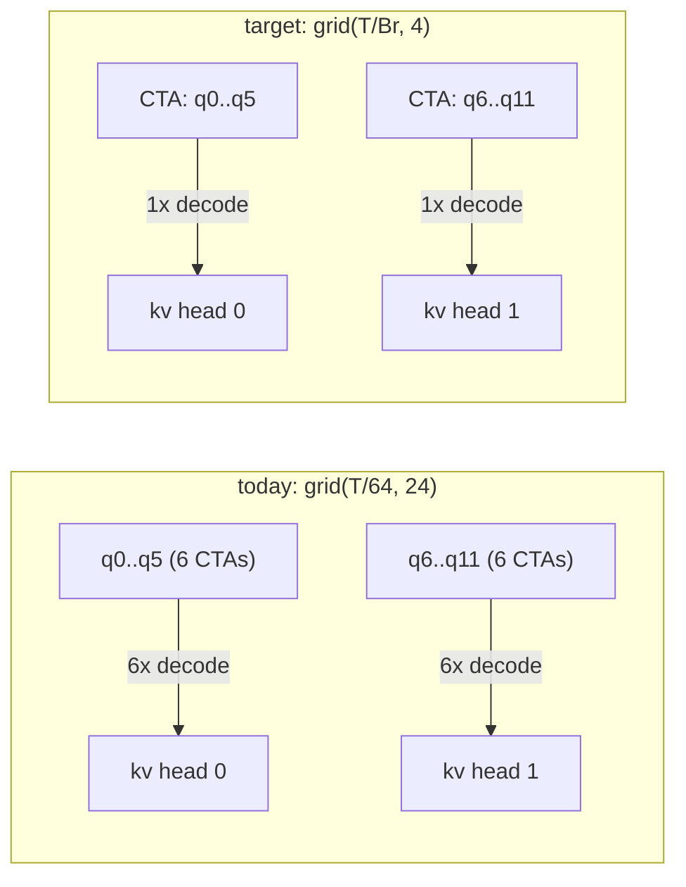
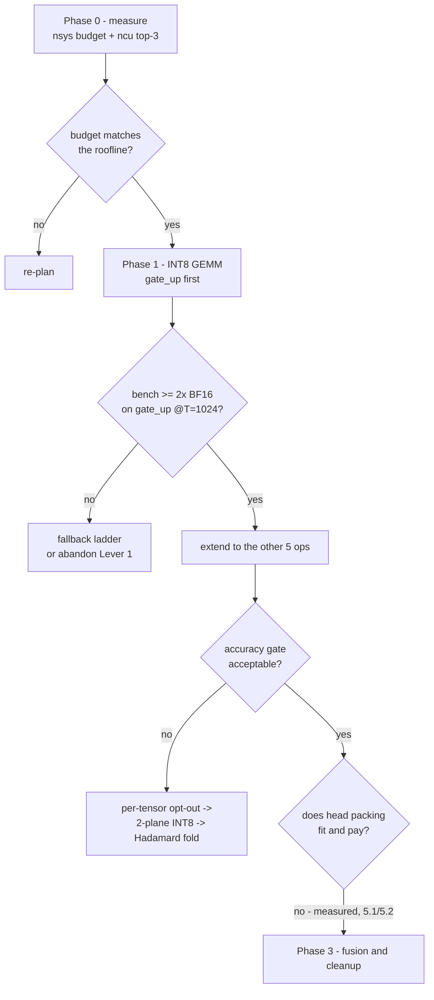

# Prefill throughput plan — sm_89 / Qwen3.8-27B `groupwise-int`

## Status and scope

Opened 2026-08-18. This is a temporary plan for active work, not a current implementation map.
It describes the target state for long-context prefill throughput on the `sm_89` build of the
`qwen3.8-27b/groupwise-int` identity.

**Phase 1 landed; Phase 2 was closed on measurement (§5.2).** The stable outcomes are migrated and
now live in `performance.md` (results, activation-compute profile, prompt-length characteristics),
`op-development.md` §2.1 (activation-profile admission rules), `linear-benchmark.md` §10 (INT8
route ceiling and its SASS attribution), and `softmax-attention.md` §11 (why head packing was
rejected). Those are the authorities. This file is retained as the supporting record: roofline
derivation, per-kernel budgets, tuning sweeps, and the reasoning behind each closed decision. Where
it disagrees with a permanent reference, the permanent reference wins.

In scope:

- text prefill throughput for `qwen3.8-27b/groupwise-int` on RTX 4090 (`sm_89`, CUDA 13.2);
- the six dense body GEMM Ops and the GQA prompt attention kernel;
- prefill-only execution routes. Decode routes are explicitly out of scope and must not change.

Out of scope: `nvfp4` weights, the 35B-A3B package, decode/MTP/DFlash throughput, serving,
the continuation cache, and the `.ninfer` container format.

---

## 1. Problem

Observed prefill on RTX 4090 is **1,000–2,000 tok/s**, which makes prompts above 100K tokens
impractical. `nvidia-smi` shows ~100% GPU utilization during prefill, so the engine is not idle or
launch-starved.

The conclusion of the analysis below is that prefill is **compute-bound at ~75% of the 4090's BF16
tensor-core ceiling**. The ceiling itself — not the schedule — is the limit.

---

## 2. Roofline

### 2.1 Dense work per token

Qwen3.8-27B: `hidden = 5120`, `layers = 64`, `intermediate = 17408`, `query_heads = 24`,
`kv_heads = 4`, `head_dim = 256`. Topology is 16 full-attention layers and 48 Gated DeltaNet
layers (`hybrid_topology.h:9-11`, `qwen3_8_27b/impl/config.h:66-67`).

| Layer kind | Count | MAC/token |
|---|---:|---:|
| Attention projection (Q4 `[7168,5120]` + Q5 `[7168,5120]`) | 16 | 73,400,320 |
| Attention output (Q5 `[5120,6144]`) | 16 | 31,457,280 |
| GDN input projection (Q4 `[4096,5120]` + Q5 `[12288,5120]`) | 48 | 83,886,080 |
| GDN output (Q5 `[5120,6144]`) | 48 | 31,457,280 |
| MLP gate/up (Q4 `[34816,5120]`) + down (Q5 `[5120,17408]`) | 64 | 267,386,880 |

**Total: 24.33 GMAC = 48.65 GFLOP per token**, independent of context length.

### 2.2 Attention work per token

Per full-attention layer, per token, at prefix length `p`: `2 × q_heads × head_dim × p` MAC.
Over 16 layers with an average prefix of `C/2` for a prompt of length `C`:

```
attention FLOP/token = 196,608 × C
```

### 2.3 Ada tensor-core rates (RTX 4090, dense)

| Instruction class | Peak |
|---|---:|
| BF16 / FP16 with FP32 accumulate | 165.2 TFLOPS |
| FP16 with FP16 accumulate | 330.3 TFLOPS |
| **INT8 with INT32 accumulate** | **660.6 TOPS** |
| INT4 with INT32 accumulate | 1321.2 TOPS |

INT8 is **4× the BF16/FP32-accumulate rate**. `mma.sync.aligned.m16n8k32.row.col.s32.s8.s8.s32`
also carries 2× the K depth per instruction (k32 vs k16), halving issue pressure for the same work.

### 2.4 Predicted budget

| Term | Model | 4090 predicted |
|---|---|---:|
| Dense GEMM | 48.65 GFLOP/token @ 165.2 TFLOPS × 75% | 393 µs/token |
| Attention @100K | 19.7 GFLOP/token @ ~440 TFLOPS blended × 30% | 149 µs/token |
| GDN, conv1d, norms, copies | — | ~50 µs/token |
| **Total** | | **~590 µs/token → ~1,700 tok/s** |

This reproduces the reported 1–2K tok/s. §2.5 replaces it with measurement.

### 2.5 Measured budget (Phase 0, RTX 4090 / sm_89 / CUDA 13.2)

118,242-token prompt, `--prefill-chunk 1024 --kv-dtype rk4v4-e8 --spec mtp`, continuation cache and
prefix reuse disabled. Measured **1,688 tok/s = 592.4 µs/token**. `nsys` attribution over the
complete prefill (`profiles/nsys/prefill_100k`):

| Category | seconds | % of prefill | µs/token |
|---|---:|---:|---:|
| **Dense GEMM** | **47.70** | **68.0%** | **403.4** |
| **GQA prefill attention** | **19.51** | **27.8%** | **165.0** |
| GDN core (`state_passing`, `prepare_wy_wu`, `output`, `l2norm`) | 1.10 | 1.6% | 9.3 |
| RMSNorm + elementwise + RoPE + embedding | 0.45 | 0.6% | 3.8 |
| `causal_conv1d` | 0.23 | 0.3% | 1.9 |
| MTP + lm_head + misc | 0.14 | 0.2% | 1.2 |
| memcpy D2D + D2H | 0.15 | 0.2% | 1.3 |
| gaps (launch, sync) | 1.03 | 1.5% | 8.7 |

Kernels account for 98.5% of wall time, so there is no launch-overhead or synchronization problem.

Per-Op dense GEMM rates at `T=1024`, from `bench/ops` (absolute TFLOP/s; the benchmarks' `% of`
columns reference the 5090's 209.5 TFLOPS / 1792 GB/s and are wrong on this box):

| Op | shape | µs/call | TFLOP/s | % of 165.2 |
|---|---|---:|---:|---:|
| `linear_swiglu` Q4 gate/up | `[34816,5120]` | 2827.3 | 129.13 | 78.2% |
| `linear_add` Q5 down | `[5120,17408]` | 1507.3 | 121.10 | 73.3% |
| `linear_add` Q5 o/gdn_out | `[5120,6144]` | 565.1 | 114.00 | 69.0% |
| `gdn_input_proj` Q4+Q5 | `[16384,5120]` | 1471.5 | 116.75 | 70.7% |
| `attn_input_proj` Q4+Q5 | `[14336,5120]` | 1753.1 | 85.75 | **51.9%** |
| **weighted aggregate per 1024-token chunk** | | **412.3 ms** | **120.85** | **73.2%** |

The aggregate 412.3 ms/chunk = 402.6 µs/token matches the `nsys` figure of 403.4 µs/token to within
0.2%, so the two independent measurements agree.

Attention, from `bench/ops/causal_softmax_attention_bench` with `d256-h24-kv4` and **int8** KV:
161.4 / 172.0 / 179.9 / 179.9 TFLOP/s at contexts 8K / 32K / 100K / 262K — **36.7% to 40.9% of the
440.4 TFLOPS blended INT8-QK + FP16-acc-PV ceiling**. Production `rk4v4-e8` measures ~25% slower
than the int8 extrapolation, which is the packed-4-bit unpack cost.

Knob sweep at the 118,242-token prompt:

| `--prefill-chunk` | tok/s |
|---:|---:|
| 1024 | 1,689.1 |
| 2048 | 1,712.5 (+1.4%) |
| 4096 | 1,714.5 (saturated) |

`--spec mtp` costs 0.2% of prefill (MTP kernels in the trace), so no A/B was needed.

### 2.6 Corrections to §2.4 forced by measurement

- **GDN + conv1d + norms + copies is 2.7%, not the estimated 8%.** Lever 3 is therefore nearly
  worthless as a throughput item and is demoted (§6).
- **`extract_bf16_columns` device-to-device copies are 0.18% of prefill**, not the ~2% assumed.
  That cleanup item is dropped.
- Attention is 27.8% at 165.0 µs/token, against a predicted 25% at 149 µs/token — close, and the
  gap is the `rk4v4-e8` unpack the model did not account for.
- `attn_input_proj` is an outlier at 51.9% of peak because its `T=1024` route selects
  `GemmCfg<32,64,...>` tiles and splits into two kernels, while the larger `gdn_input_proj` uses one
  `R64C128` kernel at 70.7%. Worth ~1.3% of prefill, but Lever 1 replaces that kernel anyway.

### 2.7 Check that could not run

`ncu` performance counters are unavailable on this box: `RmProfilingAdminOnly: 1` and no sudo, so
every `ncu` launch returns `ERR_NVGPUCTRPERM`. The two questions Phase 0.4 existed to answer were
resolved without it — dense-GEMM headroom from absolute benchmark rates against the known ceiling,
and attention boundedness from its 36.7–40.9% arithmetic efficiency plus the `rk4v4-e8` delta.
Stall-reason attribution for INT8 kernel tuning is consequently unavailable and tuning proceeds by
measured wall time per schedule instead.

---

## 3. Evidence that the MMA rate is the lever

`performance.md:409-446` records both weight identities on the same GPU (RTX 5090), same model,
same attention kernels, same schedule:

| Weights | 7,680 prompt | 260,096 prompt | fixed term | context term |
|---|---:|---:|---:|---:|
| `groupwise-int` (dequant → BF16 MMA) | 3,218 tok/s (311 µs) | 1,615 tok/s (619 µs) | 311 µs | **308 µs** |
| `nvfp4` (native 4-bit MMA) | 11,191 tok/s (89 µs) | 2,511 tok/s (398 µs) | 89 µs | **308 µs** |

Two facts follow.

1. **The context term is identical (308 µs).** Both identities share
   `gqa_attention_prefill_i8_kernel`, so this term isolates attention exactly.
2. **The fixed term differs 3.5×**, entirely from the MMA instruction. Back-solving efficiency:
   `groupwise-int` reaches 157 TFLOPS of a 209.5 TFLOPS BF16 ceiling (**75%**); `nvfp4` reaches
   545 TFLOPS of an 838 TFLOPS FP4 ceiling (**65%**). Both are well-tuned.

**There is no 2× hiding in the BF16 kernels.** Micro-tuning tile sizes and pipelines is not a
productive direction. Changing the instruction is.

The same back-solve gives attention efficiency: 51.5 GFLOP/token / 308 µs = 166 TFLOPS against a
blended INT8-QK + FP16-PV ceiling of ~559 TFLOPS on the 5090 — **~30%**. Attention has headroom of
a different kind (see §5).

---

## 4. Lever 1 — INT8 tensor cores for prefill GEMMs

### 4.1 Why the artifact does not change

Registered formats (`tensor-formats.md:24-33`) are symmetric group quantization with no zero point:

| Format | Code width | Group | Legal codes | Scale |
|---|---:|---:|---|---|
| `Q4G64_F16S` | 4 | 64 | `[-8, 7]` | 1 × binary16 per group |
| `Q5G64_F16S` | 5 | 64 | `[-16, 15]` | 1 × binary16 per group |

Q4 and Q5 codes are **already integers inside the INT8 range**. Feeding them to `mma.s8` is exact —
there is no weight-side quantization error at all, and the dequantization arithmetic disappears.
`models/qwen3_8_27b.ninfer` is reused byte-for-byte; the `row-split-k128-v1` layout
(`storage-layouts.md:80-250`) is unchanged.

### 4.2 What the current kernel does

`src/ops/linear/q4/q4_rowsplit_gemm_mma.cuh` stages one 64-value quant group per K tile and, per
tile:

```
cp_wait; __syncthreads();          // :306
decode_weight(stage, k_tile);      // :308  Q4 -> ×FP16 scale -> cvt BF16 -> smem As
__syncthreads();                   // :309
4 × mma.m16n8k16.f32.bf16          // :341 (ping-pong) / :358 (serial)
__syncthreads();                   // :366
stage_inputs(prefetch)
```

Three structural problems, independent of the instruction change:

1. **`As` is single-buffered** (`:119`). The `__syncthreads()` at `:309` strictly serializes weight
   decode against MMA — tensor cores idle through every dequant.
2. **`kBlockK == 64` is forced** by `static_assert` at `:71`, giving only 4 MMA k-steps between 3
   barriers.
3. **Weight decode produces BF16**, costing an int→float convert, a scale multiply, a pack, and a
   16-bit-per-element shared-memory round trip for every weight element.

### 4.3 Target formulation

Per 64-element quant group `g`, output row `r`, token column `c`:

```
acc_s32  = Σ_{k∈g} wq[r,k] × xq[k,c]                mma.m16n8k32.s32.s8.s8.s32
acc_f32 += float(acc_s32) × w_scale[r,g] × x_scale[g,c]
```

Overflow headroom: `|acc_s32| ≤ 64 × 16 × 127 = 130,048`, far inside INT32. Cross-group
accumulation stays FP32, matching today's accumulator precision.

### 4.4 Weight decode: code → INT8

Q4 nibbles unpack with pure integer logic, no FP math. For four packed codes in a `u32`:

```
u32 x = v & 0x0F0F0F0F;                    // nibbles in [0,15]
u32 r = x | ((x & 0x08080808) * 0x1E);     // sign-extend 4->8 per byte
```

(`0x08 × 0x1E = 0xF0`; `0x08|0xF0 = 0xF8 = -8`, `0x0F|0xF0 = 0xFF = -1`.)

Q5 merges the 1-bit high plane first, then the same trick with `0x10101010 × 0x0E`. Roughly
**4 integer ops per 4 codes**, replacing the current convert/multiply/pack chain.

`mma.m16n8k32` A-fragments need 4 contiguous K bytes per lane per register, which is exactly 2
packed Q4 bytes — a 16-bit shared-memory load per fragment word. `ldmatrix` is a 16-bit-element
instruction and is not used on this path; B (activation) fragments are 4 contiguous K bytes and
load as plain 32-bit words from a swizzled INT8 tile.

### 4.5 Activation quantization

The only new numerics. Activations are `[K, T]` with K contiguous
(`q4_rowsplit_gemm_mma.cuh:379` writes `out[col*rows + row]`), so a 64-channel group is a
contiguous 128-byte span of one token — cheap to reduce and cheap to load.

**Primary scheme: symmetric INT8 with per-token, per-64-channel-group scales.** This is the same
granularity as the weights, and strictly finer than QServe-class W4A8 (per-token) or Atom
(group 128). A single outlier channel degrades only its own group of 64 out of 5120 channels.

Placement in Phase 1: a **private staging pass inside the Op wrapper**, writing INT8 codes plus
FP32 group scales into the caller's `WorkspaceArena`. Per `op-development.md` §2 rule 4 this is a
partial step beneath a complete transformation, so it is an implementation detail of the enclosing
GEMM Op, **not a new Op**, and no Op contract or target code changes. Phase 3 promotes it into the
producing Ops, at which point it becomes a real contract change.

Cost: one extra pass over `x`. For MLP gate/up (`x = [5120,1024]`) that is ~16 µs against a ~555 µs
GEMM (2.9%). For MLP down (`x = [17408,1024]`) it is ~53 µs against ~276 µs (19%) — which is why
that one is the first Phase 3 fusion target.

### 4.6 Known efficiency risk: the per-group rescale

Today the FP16 group scale is applied to the **weight** during decode: `BM × BK` operations per
tile. In the INT8 formulation it must be applied to the **accumulator**: `BM × BN` operations per
group, because an INT8 weight cannot carry an FP16 scale.

This is inherent to every W4A8 kernel and lands roughly 2 FP32 ops per accumulator element per 64
K-elements — about 20–25% additional FMA-pipe work relative to the tensor-pipe work. It runs on a
different execution pipe than the MMA and overlaps given enough warps in flight, but it costs issue
bandwidth. Mitigations to evaluate empirically, in order:

1. `kBlockK` of 128 or 256 (2–4 groups per staged tile) to amortize barriers and staging;
2. double-buffered decoded-A so decode overlaps MMA (removes the `:309` serialization);
3. wider `BN` so each decoded A-fragment is reused across more token columns;
4. a **per-token-only** activation scale variant, which moves the whole activation factor into the
   epilogue and halves the per-group work, at the cost of coarser granularity — A/B it against the
   per-group variant on both speed and accuracy.

INT8 staging also halves shared-memory traffic (the current schedule uses 45,312 of 48 KiB), which
directly buys larger tiles.

### 4.6a Measured: the instruction rate is real, the staging pattern is the limiter

All numbers below are RTX 4090 / sm_89 / CUDA 13.2, shape `rows=34816 k=5120 cols=1024`
(`linear_swiglu` Q4 gate_up at `T = 1024`), against the production BF16 MMA route at
**130.7 TFLOP/s**.

**Instruction ceiling (register-resident, no memory traffic).** Back-to-back MMA throughput on this
card:

| instruction | TFLOP/s | vs BF16 |
|---|---|---|
| `mma.m16n8k16.f32.bf16.bf16.f32` | 171.7 | 1.00× |
| `mma.m16n8k16.f16.f16.f16.f16` | 342.9 | 2.00× |
| `mma.m16n8k32.s32.s8.s8.s32` | **686.1** | **4.00×** |

§2.3's 4× assumption is confirmed on the actual device. The instruction is not the problem.

**The first INT8 schedules did not beat BF16.** Six `BK = 64` schedules ranged 66.6–175.6 TFLOP/s;
only `BM=128 BN=256 WM=32 WN=64` exceeded BF16, at 1.34×. `ptxas -v` showed no spills except
`BM=256 BN=128` (255 registers, 48 B spill), so register pressure was not the cause.

**Ablation isolated the cause.** Removing individual stages from the inner loop at `BM=128 BN=128`
(8 warps) changed nothing — `full` 2.828 ms, `no_mma` 2.702 ms. Deleting *every tensor-core
instruction* saved 4%. The kernel was not executing math; it was waiting on staging.

**Two experiments identified the mechanism.** Shrinking `rows` until the weight codes fit in L2
(72 MB) separates streaming cost from compute cost:

| schedule | rows=34816 (89 MB codes) | rows=4096 (10.5 MB codes) |
|---|---|---|
| production BF16 MMA | 130.7 | 129.2 |
| INT8 `BN=64` | 66.7 | 181.3 |
| INT8 `BN=128` | 128.9 | 194.0 |
| INT8 `BN=256` | 175.7 | 219.0 |

The BF16 route is unaffected by weight residency: it is genuinely compute-bound at 76% of its
171.7 TFLOP/s ceiling, and its apparent health is a coincidence — its compute limit sits just below
the streaming limit. The INT8 routes lose 25–63% to streaming.

Re-running the identical kernel against a group-major copy of the codes (`codes[g][row][32]`
instead of the artifact's `codes[row][g][32]`), changing only global addresses:

| BN | `codes[row][g]` | `codes[g][row]` | gain |
|---|---|---|---|
| 64 | 68.4 | 172.0 | 2.51× |
| 128 | 128.5 | 165.0 | 1.28× |
| 256 | 168.0 | **205.9** | 1.23× |

**Mechanism: memory request count, not DRAM bytes.** For a fixed group, consecutive rows are
`32 × n_groups` = 2560 B apart. A warp staging 32 × 16 B therefore touches 16 distinct 128 B
regions and issues 16 requests, against 4 for a contiguous 512 B stage. DRAM bytes are not wasted —
the L2↔DRAM sector is 32 B, exactly the amount read, and `cp_async<16>` already defaults to
`Cache::ca` so L1 is not being bypassed. The remaining 96 B of each line *is* consumed, but three
iterations later. The cost is request throughput.

**Consequence for the design.** `kBlockK = 256` stages one full 128 B line per row, so 32 threads
cover 4 rows and issue 4 requests — identical to the group-major result — and it does so **without
changing the artifact layout or any existing BF16 kernel**. It also cuts barriers 4×, which
addresses the second measured problem: with weights L2-resident the best schedule still runs 6278
clocks per group against 2114 ideal (3.0×), with only 4 warps per scheduler to cover two barriers
per 64 K-elements. Mitigation 1 of §4.6 is therefore promoted from "evaluate" to the primary
structural fix, and mitigation 3 is confirmed (`BN = 256` beats `BN = 128` in every configuration).

Clean compute attribution with weights L2-resident, `BM=128 BN=256` (16 warps): per-group rescale
12.4%, weight decode 8.1%. Both are real but neither explains the 3.0× gap; barrier and staging
serialization does.

**Planned schedule.** Weight super-group double-buffered at `BK = 256`, activations triple-buffered
at 64, `BM=128 BN=256 WM=32 WN=64` (16 warps): `Cr[2][128][128]` swizzled 32,768 B +
`Sw[2][128][4][2]` 2,048 B + `Bq[3][256][64]` 49,152 B + `Sx[3][256][4]` 3,072 B = **87,040 B**,
within Ada's 99 KB dynamic shared-memory limit.

### 4.6b Result of the tuning sequence

Each change below is cumulative, measured on `rows=34816 k=5120 cols=1024` against BF16 at
130.7 TFLOP/s.

| change | TFLOP/s | vs BF16 |
|---|---|---|
| `BK=64`, `codes[row][g]` staging (§4.6a start) | 175.7 | 1.34× |
| `BK=256` weight super-group, swizzled `Cr` | 209.9 | 1.61× |
| per-tile immediate rescale (removes `s32[MT][NT][4]`, unblocks `WN=128`) | 225.1 | 1.72× |
| single barrier per group (`kActStages = 3`) | 228.4 | 1.75× |
| super-group loop with the four member groups unrolled | **230.0** | **1.76×** |

Best schedule: `BM=128 BN=256 WM=32 WN=128`, `kActStages = 3`, 87,040 B shared, 8 warps,
no spills. With weights made L2-resident the same schedule reaches ~229 TFLOP/s, so **streaming is
no longer a limiter** — the residual is compute.

**Pipeline depth correction.** The single-barrier pipeline above was first written with
`cp_wait<kActStages - 1>`, which `compute-sanitizer --tool racecheck` reports as a
write-vs-read hazard between `cp_async<16>` and the `Cr` fragment reads. Commit index `j` carries
activation group `j`, so entering iteration `g` there are `AST - 1 + g` commits outstanding and
groups `0..g` must have landed: at most `AST - 2` may still be pending. The error is present in
steady state, not only in the prologue, and was masked because the copy being consumed was issued a
full iteration earlier and had already arrived in practice. Because `AST` slots also cap the
prefetch distance at `AST - 1`, `cp_wait<AST - 2>` is both the correct and the deepest legal
overlap. Correcting it leaves throughput unchanged (230.1 TFLOP/s unfused, 1.78× fused at
`T = 1024`) and clears racecheck to 0 hazards.

**Why it stops at 1.76×.** SASS for the inner loop shows 32 `IMMA` against roughly 850 other
instructions per group — 26 non-MMA instructions per MMA:

| class | per group | cause |
|---|---|---|
| `IMAD`/`LEA`/`IADD3`/`SHF` | 319 | shared-memory address arithmetic |
| `I2FP`/`FMUL`/`FFMA` | 192 | the §4.6 per-group rescale |
| `PRMT`/`LOP3` | 136 | Q4 code → INT8 decode |
| `LDS` | 60 | fragment loads |
| `IMMA` | 32 | the arithmetic itself |

The rescale and the decode are inherent to W4A8 at group 64 and cannot be removed without changing
numerics. The accumulator itself is the occupancy wall: a `32x128` warp tile needs 128 FP32
accumulator registers, so a CTA can never fall under the 64-register threshold for two blocks per
SM. That fixes the schedule at one CTA/SM and 8–16 warps, which is too few to hide the dependent
decode chain, and larger warp tiles trade warp count for a better instruction ratio without a net
gain.

**Speedup across the real dense shapes**, best schedule per shape:

| shape (`rows × k`) | role | `cols` | INT8 | vs BF16 |
|---|---|---|---|---|
| 34816 × 5120 | `linear_swiglu` gate_up | 2048 | 242.5 | 1.82× |
| 34816 × 5120 | `linear_swiglu` gate_up | 1024 | 230.0 | 1.76× |
| 34816 × 5120 | `linear_swiglu` gate_up | 512 | 216.0 | 1.69× |
| 5120 × 6144 | `linear_add` | 1024 | 202.2 | 1.57× |
| 5120 × 17408 | `linear_add` down | 1024 | 198.9 | 1.56× |

Weighting by the Phase 0 per-op times gives a **1.68× aggregate** over the dense GEMM budget. The
narrow shapes lose to grid quantization: `rows = 5120` at `BM = 128` yields 40 row blocks, so the
grid is 2.5 waves over 128 SMs.

**Gate 1.4 is not met.** The gate is ≥2×; the primary shape reaches 1.76× and the aggregate 1.68×.
Accuracy is unchanged from the first working kernel at `rel_frobenius` 1.404e-02 against an FP64
oracle, 5.80× the BF16 route's 2.421e-03, on synthetic data with deliberate 25–60× outlier channels.

### 4.6c Step 1.4 landed: `linear_swiglu` Q4

The fused route (`q4_linear_swiglu_int8_gemm.cuh`) reuses the arithmetic contract above and adds the
gate/up fold. The BF16 route folds with a single 64-row warp tile, which forces one warp row per
block; the INT8 schedule needs more warps than that allows, so the mapping is generalised — a warp
owns `kWarpPairRows` gate rows and the matching up rows, and accumulator tile `mi` pairs with
`mi + kMmaPairRows` in the SiLU epilogue. Registered schedule `PM=64 BN=256 WPR=16 WN=128`,
`kActStages = 3`, 87,040 B shared, 8 warps, 128 registers, no spills.

Measured against the registered BF16 fused route, **activation quantization included**:

| T | 128 | 256 | 384 | 512 | 641 | 1024 | 2048 |
|---|---|---|---|---|---|---|---|
| ratio | 0.94× | 1.59× | 1.47× | 1.68× | 1.87× | 1.78× | 1.87× |

The route is registered for `T >= 257`, which is an existing catalog boundary. It beats the unfused
GEMM's 1.76× because the fold avoids materializing `gate_up`.

**End-to-end on the §8 protocol** (`--kv-dtype rk4v4-e8`, `--max-context 262144`,
`--prefill-chunk 1024`, `--continuation-cache off`, `--no-prefix-reuse`), 115,125-token prompt:

| build | prefill |
|---|---|
| A16 baseline | 1,701.4 tok/s |
| INT8 `linear_swiglu` | **1,977.7 tok/s** |

**1.162× end-to-end from one Op**, against a 1.116× prediction from the §2.5 budget share. Both
arms omit `--spec mtp`, which §2.5 measured at 0.2%. The baseline reproduces §2.5's 1,688 tok/s to
within 0.8% at a slightly shorter prompt, which confirms the harness.

`rk4v4-e8` is the KV format of record for every end-to-end number in this plan. It is not
interchangeable: `int8` and `bf16` KV do not fit a 262,144-token capacity on a 24 GB card
(`int8` requires 9.37 GB of runtime reservation against 7.76 GB available), and §3 measured
`rk4v4-e8` attention roughly 25% slower than `int8`. Measuring a dense-GEMM change on `int8` KV
therefore both changes the context capability and understates attention's share of the budget,
inflating the apparent end-to-end ratio.

**Activation quantization is a declared semantic boundary, not a private implementation choice.**
Group-64 INT8 costs roughly 8× the BF16 route's error against the FP64 oracle on dense activations,
so the route is reachable only through `LinearPolicy::AllowA8`, exactly as NVFP4's W4A4 routes are
reachable only through `AllowA4`. `A16Only` keeps the pre-existing catalog and stays bit-identical.
The existing `test_q4_a16.cpp` passes either way, but that is not evidence the route is accurate:
its activations are sparse (four nonzeros per token beyond token 0), which makes group-64
quantization nearly exact. `test_q4_a8.cpp` covers the A8 profile with its own criterion, and the
model-level check at step 1.9 remains the real accuracy gate.

The quantized activation staging is O(T), so the route contracts tokens in bounded tiles of 4,096
and its workspace is ~22 MiB regardless of context length. Sizing it at the full context would add
1.4 GiB to the Engine reservation on a 24 GB card.

**Consequence for §9a.** With dense at 1.68× the dense budget falls 403.4 → 240.1 µs/token and
end-to-end lands near 2,330 tok/s before Lever 2, or roughly 2,650–2,700 tok/s with an optimistic
1.5× on GQA attention. **The 3,000 tok/s target requires close to 2× on both levers and is not
reachable with Lever 1 as measured.** §9a's projections assumed the §2.4 4× MMA headroom would
translate more directly than the instruction mix allows.

### 4.6d Step 1.5 landed: `linear_add` Q5

`q5_linear_add_int8_gemm.cuh` is the Q5 storage variant of §4.6b's tuned GEMM plus an in-place
residual epilogue. Two things differ from Q4.

**The high plane.** Q5 splits its codes into 32 bytes of low nibbles and 8 bytes of fifth bits per
64-value group. Staged per super-group the high plane is only 32 bytes per row — a quarter of a
line — so it doubles the weight request count while adding an eighth of the weight bytes. Widening
the staging window to two and four super-groups (a full line per row) was measured and changed
nothing: **1.44× / 1.44× / 1.43×**. Request count is not the limiter, so the narrowest window is
kept and the parameter was removed.

What did help was the decode itself. The four high bytes a fragment needs sit at `base + 0..3`, one
aligned 32-bit word, and the byte select folds into the shift because
`8*(group_col/2) + 4*(group_col&1)` is exactly `4*group_col`. One `LDS.u32` replaces four byte
loads and the extraction disappears: **1.44× → 1.52×**. This is consistent with §4.6b — these
routes are limited by the dependent decode chain, not by memory or MMA issue.

**Occupancy.** The winner is small in both tile dimensions — `R64C128 W16x64`, 32 accumulator
registers, 49,664 B shared, two CTAs per SM. Wider warp tiles lose 10–30%, the opposite of the Q4
GEMM's preference for `WN=128`, because the extra Q5 decode work needs warps to hide it.

Registered schedule `BM=64 BN=128 WM=16 WN=64`, `kActStages = 3`. Measured against the registered
BF16 `MmaResidualR64C128`, **activation quantization included**:

| T | 256 | 512 | 768 | 1024 | 1536 | 2048 |
|---|---|---|---|---|---|---|
| `k=6144` | 1.50× | 1.73× | 1.51× | 1.62× | 1.51× | 1.33× |
| `k=17408` | 1.50× | 1.66× | 1.40× | 1.49× | 1.41× | 1.41× |

Error against the FP64 oracle is 1.586e-02 against the BF16 route's 2.973e-03, a ratio of 5.34×,
on the same dense-with-outliers profile §4.6a used. The route is registered for `cols >= 129` in
both catalogs, which is the existing boundary the BF16 catalog already gives to
`MmaResidualR64C128`; every narrower interval is shared with A16 and stays bit-identical.

**End-to-end on the §8 protocol**, 115,125-token prompt, same session:

| build | prefill | step | cumulative |
|---|---|---|---|
| A16 baseline | 1,701.4 tok/s | — | 1.000× |
| + INT8 `linear_swiglu` (§4.6c) | 1,976.4 tok/s | 1.162× | 1.162× |
| + INT8 `linear_add` | **2,147.3 tok/s** | **1.086×** | **1.262×** |

The middle row re-measures §4.6c's arm in this session and reproduces its 1,977.7 tok/s to within
0.07%, which confirms that the pipeline-depth correction above and the extraction of
`act_quant_g64` into its own compilation unit are both end-to-end neutral.

Note that `--targets` in the probe is a *word* count, not a token count; 100,000 words is the
115,125-token prompt used throughout. Comparing runs at different `--targets` values compares
different context lengths and therefore different attention shares.

The quantized activation staging is O(T) and bounded at 4,096-token tiles as in §4.6c; at
`k = 17408` that holds the workspace at ~69 MiB regardless of context length.

### 4.6e Step 1.6 landed: `attn_input_proj` and `gdn_input_proj`

Step 1.6 unified the two INT8 GEMMs into one template and added INT8 routes for both fused
projection pairs. Both are admitted (§9b).

`src/ops/common/int8_rowsplit_gemm.cuh` now carries the single INT8 row-split GEMM, parameterized
by codec (Q4/Q5) and epilogue (`Store`/`AddResidual`), and replaces the separate Q4 and Q5 GEMM
headers. `int8_proj_launch` quantizes the activation once per token tile and runs each projection
as a job against that shared buffer: four jobs for attention (q, gate, k, v), three for GDN. The
schedule is chosen from output rows alone — `<128,128,32,64,3,1>` at `rows >= 2048`, else
`<64,64,16,64,3,1>`.

Op-level tuning at `k=5120`, `T=1024` (TFLOP/s):

| rows | Q4 | Q5 | BF16 Op |
|---|---|---|---|
| 6144 | 234.5 | 212.5 | 85.75 (attn, 51.9% of peak) |
| 1024 | 151.1 | 146.7 | 116.75 (gdn) |

End-to-end on the §8 protocol at the 115,125-token prompt: **2,406.6 tok/s**, a 1.121× step over
step 1.5 and **1.415× cumulative**.

**Call invariance.** Both pass the FP64 oracle at every T under an A8 criterion of
`{4.0e-2, 2.0e-2, 5.0e-2}`, and both are bitwise invariant to the width of the call and to the
column a token lands in — `verify_call_invariance` in `tests/ops/test_attn_input_proj.cpp` asserts
the second property, which prefix reuse depends on because reuse re-indexes the first uncached
token to column 0. For that invariance the A8 catalogs are a single route over all T; splitting
them by token count would make a prefix computed at `T=4` disagree with the same tokens inside a
full-prompt chunk.

The routes still move model output. Unlike the MLP and residual Ops, these projections feed the
attention scores and the FP32 GDN recurrence, so the added activation error propagates through a
softmax and a recurrence rather than a residual stream. Measured with `--greedy` on a 65-token
prompt, 48 new tokens:

| build | vs A16 reference |
|---|---|
| steps 1.4 + 1.5 | identical |
| steps 1.4 + 1.5 + 1.6 | diverges at token ~42 |

**Short-prompt cost.** The A8 catalog covers every T, so short prompts take INT8 where the tuned
small-T BF16 routes were faster. Measured against an A16-projection build, same server settings,
`rk4v4-e8`:

| prompt tokens | A16 tok/s | A8 tok/s | ratio |
|---:|---:|---:|---:|
| 99 | 185.5 | 177.3 | 0.96 |
| 229 | 447.2 | 434.1 | 0.97 |
| 770 | 1311.4 | 1334.5 | 1.02 |
| 2827 | 2316.0 | 2535.7 | 1.10 |
| 8105 | 2760.0 | 3186.5 | 1.16 |

Break-even is near 770 tokens and the worst case is ~15 ms on a 229-token prompt. This is accepted
rather than fixed with a token-count threshold: the plan's step 1.7 ("large T only") would recover
it, but it would also make a token's projection output depend on the width of the call that
produced it, which increases how far prefix reuse can drift rather than reducing it.

This also cost the visual MTP bridge's exact greedy reproduction of full prefill. The two arms
decompose the same prompt into different prefill calls, so the FP32 GDN recurrence accumulates over
different chunk boundaries; they were never bitwise identical, and A8 moved this case across an
argmax margin the BF16 route happened to clear. Each projection alone still passes; only both
together cross it. `test_engine_prefix_real.cpp` now asserts the observable contract — same prompt,
same token count, reuse actually taken — rather than arithmetic equality, and
`concurrent-inference-architecture.md` §6.4 states the same limit.

### 4.7 Route gating — prefill only

New INT8 schedules register **only for large `T`** in the existing closed route catalogs
(`q4_linear_swiglu_plan.cpp:34-45`, `q5_linear_add_plan.cpp:39-56` — separate `k=6144` and
`k=17408` catalogs, `q4_q5_attn_input_plan.cpp:27-31`, `q4_q5_gdn_input_plan.cpp:28-31`). The
`T = 1..8` decode schedules are untouched.

This is a hard requirement, not a convenience: decode is weight-bandwidth bound, gains nothing from
a faster MMA, and any numerical change there would affect MTP acceptance and published decode
results. **Decode numerics and throughput must be bit-identical after Phase 1.**

Route catalogs remain exact, contiguous, and `static_assert`-closed.

### 4.8 Ops in scope

Ordered by contribution, from `qwen3_8_27b/impl/variant.cpp`:

| Op | Shape | Weights | Layers |
|---|---|---|---:|
| `linear_swiglu` | `[34816,5120]` | Q4G64 | 64 |
| `linear_add` | `[5120,17408]` | Q5G64 | 64 |
| `linear_add` | `[5120,6144]` | Q5G64 | 64 |
| `gdn_input_proj` | `[4096,5120]` + `[12288,5120]` | Q4+Q5 | 48 |
| `attn_input_proj` | `[7168,5120]` + `[7168,5120]` | Q4+Q5 | 16 |

`gdn_norm_gating_proj` is BF16 `[48,5120]` and stays as-is.

### 4.9 File plan

```
src/ops/common/int8_mma.cuh              mma.s8 fragment helpers, Q4/Q5 code->int8 unpack
src/ops/common/act_quant_g64.cuh         group-64 activation quantizer (device)
src/ops/launcher/act_quant.cu            quantizer launcher (private to src/ops)
src/ops/linear_swiglu/q4/q4_linear_swiglu_i8mma.{cu,cuh}
src/ops/linear_add/q5/q5_linear_add_i8mma.{cu,cuh}
src/ops/attn_input_proj/q4_q5/q4_q5_attn_input_i8mma.{cu,cuh}
src/ops/gdn_input_proj/q4_q5/q4_q5_gdn_input_i8mma.{cu,cuh}
```

Ownership is unchanged: every kernel stays under `src/ops`, `src/targets` is not touched in
Phase 1, and no Op contract in `include/ninfer/ops/` changes.

Each INT8 instantiation family gets its **own static archive** with
`JOB_POOL_COMPILE heavy_cuda_compile`, following the existing pattern at
`src/CMakeLists.txt:258-292`. That pattern exists because combined instantiations already generate
~300 MiB of PTX here; new families must not be added to `ninfer_ops` directly.

### 4.10 Numerical contract and verification

The oracle is unchanged: one independent naive FP32/FP64 evaluation of `out = W·x` decoding the
signed code with the exact stored scale. Per `AGENTS.md`, activation quantization inside a route is
an **implementation profile**, not a semantic requirement, so the INT8 route is checked directly
against the same oracle with a criterion appropriate to its profile.

Verification, in order:

1. Op-level oracle at the real registered shapes at `T = 1024`. Report relative Frobenius error of
   **both** routes against the same FP32 oracle — the BF16 route's error is the reference scale.
2. `bench/ops/q4_linear_swiglu_bench`, `q5_linear_add_bench`, `attn_input_proj_bench`,
   `gdn_input_proj_bench` at `T = 1024` and `T = 2048`.
3. End-to-end prefill tok/s at 8K / 32K / 100K / 260K.
4. Model quality (§4.11).

### 4.11 Accuracy gate and fallback ladder

Cheap gate first, expensive gate once:

- **Greedy top-1 agreement.** Same prompt set, `temperature 0`, INT8 route vs BF16 route; measure
  first-divergence position and per-position top-1 agreement rate. Fast and highly sensitive.
- **Full evaluation** via `eval/configs/qwen3_8_27b_reasoning.yaml` — AIME 2025, AIME 2026,
  GPQA-Diamond — against the published `groupwise-int` results (86.67% / 93.33% / 86.87%,
  `performance.md:397`). ~2.5–3 h per pass, so run it once at the end of Phase 1.

If quality regresses, escalate in this order:

1. **Per-tensor BF16 opt-out.** Routes are selected per call, so specific layers (identified by
   parity) can keep the BF16 path at near-zero cost.
2. **Per-group activation scales** if the per-token variant was chosen for speed in §4.6.
3. **Two-plane INT8 decomposition.** `a ≈ a_hi·2⁻⁷ + a_lo·2⁻¹⁴`, two `mma.s8` per tile. ~16-bit
   activation fidelity, essentially zero accuracy risk, still **2×** over BF16.
4. **Converter-side Hadamard-64 fold.** `W·x = (W·Hᵀ)(H·x)` with a block-diagonal 64-point
   Hadamard spreads outliers within each group before quantization. The Hadamard-64 machinery
   already exists in `gqa_attention_kv_quant.cuh` for the KV cache. This requires requantizing the
   weights, i.e. downloading the BF16 checkpoint (~55 GiB; 189 GiB free) and re-running
   `tools/convert/qwen3_8_27b`. Last resort only.

---

## 5. Lever 2 — GQA attention: stop decoding the KV cache six times

**Gated on Phase 0.4 evidence.** Do not start this before `ncu` confirms the kernel is decode or
traffic bound rather than MMA bound.

`src/ops/launcher/gqa_attention_prefill.cu:29-31` launches:

```
grid = (ceil(T / 64), 24 q_heads, 1)
```

With `q_heads = 24` and `kv_heads = 4`, six CTAs independently stream, unpack, and stage the
**same** K/V history for each KV head. Under `--kv-dtype rk4v4-e8` the read path takes the
`PackedK` branch at `gqa_attention_prefill_i8.cuh:529-535`: `gqa_kv_unpack_i4x16` for K and V, then
a packed-FP16 dequant of V (`gqa_prefill_i8_dequant_f16x8`, `:73-108`, applied at `:767`) into a
32 KiB staging buffer. The E8 lattice is an **encode-side** codec only — the `e8_root_decode_8d_int8`
path at `:512-522` belongs to `rk2v4-e8`, not `rk4v4-e8` — so the redundant work is packed-4-bit
unpack plus FP16 dequant plus shared-memory staging, repeated six times over identical bytes. The
kernel runs at ~30% of its blended MMA ceiling (§3), consistent with being bound by that rather
than by the MMA.

Phase 0.5's `--kv-dtype int8` vs `rk4v4-e8` A/B isolates exactly this cost: `int8` skips the
4-bit unpack and both Hadamard rotations.

The fix is to pack the GQA group into one CTA so each decoded K/V tile serves all six query heads —
the `mma.s8` B-fragment is bit-identical across them.



The binding constraint is resource, not algorithm. Per CTA today: 93,696 B of shared memory of a
100 KiB Ada limit, and an FP16 PV accumulator of `Br × head_dim` split across 16 warps. Packing
`H` heads multiplies both the Q tile and the O accumulator by `H`. Number of KV streams is
`(T / Br) × (grid heads)`:

| Configuration | KV streams | Reduction | Feasibility |
|---|---|---:|---|
| `Br=64, H=1` (today) | `0.375·T` | 1.0× | current |
| `Br=64, H=6` | `0.0625·T` | 6.0× | O accumulator and Q tile do not fit |
| `Br=32, H=6` | `0.125·T` | 3.0× | fits if the 32 KiB V FP16 staging buffer is removed |
| `Br=16, H=6` | `0.25·T` | 1.5× | fits easily, weak payoff |

Expected landing point: **`Br=32`, `H=6`, `Bc=64`**, with V dequantized straight into MMA fragments
instead of the 32 KiB FP16 staging buffer, and a KV-split grid dimension if a wave turns out to be
short (`grid(T/32, 4) = 128` CTAs at `T=1024`, which already matches the 128 SMs).

Note that `RotateV` also forces a separate full-output inverse-rotation kernel after every prefill
attention launch (`gqa_attention_prefill.cu:69-74`). Folding that into the packed kernel's epilogue
is a free side benefit of the rewrite.

### 5.1 Measured ceiling — the §5 model above is wrong

**Measured 2026-08-19, before starting the rewrite.** The §5 estimate is not supported.

Re-profiling at the §8 protocol gives a new budget, because making the dense GEMMs 1.262× faster
raised every remaining share. This was measured with steps 1.4+1.5 admitted and step 1.6 still held
back, so the last two rows are the BF16 projections that step 1.6 has since replaced:

| kernel | share |
|---|---|
| `gqa_attention_prefill_i8_kernel` | **34.6%** |
| `q4_linear_swiglu_int8_gemm_kernel` (step 1.4) | 20.7% |
| `int8_rowsplit_gemm_kernel`, Q5 `AddResidual` (step 1.5) | 18.5% |
| `rowsplit_grouped_mma_kernel` `GemmCfg<64,128,…>`, GDN input proj | 15.1% |
| `rowsplit_grouped_mma_kernel` `GemmCfg<32,64,…>` ×2, attn input proj | 6.0% |
| `gqa_kv_inverse_rotate_output_kernel` | 0.2% |

The Phase 0.5 A/B now bounds Lever 2 directly. At the 115,125-token prompt, capacity 131,072 for
both arms, changing only the KV dtype:

| KV dtype | prefill | µs/token |
|---|---:|---:|
| `rk4v4-e8` | 2,146.9 tok/s | 465.8 |
| `int8` | 2,275.9 tok/s | 439.4 |

`int8` removes the packed-4-bit unpack and both Hadamard rotations **entirely**, and it is worth
26.4 µs/token — 5.7% of prefill, or 16.5% of the attention kernel. Head packing does not remove the
unpack; it removes only its *redundancy*. At the §5 landing point (`Br=32`, `H=6`) the KV-stream
count falls 3×, not 6×, so the saving is 2/3 of 26.4 = 17.6 µs/token:

**Lever 2 ceiling ≈ 1.04× end-to-end**, against the 1.17× implied by "149 → 81 µs/token".

### 5.2 Not attempted — the §5 design does not fit, and the fitting one does not pay

Two structural facts kill the configuration §5 specifies.

**The shared-memory budget is wrong.** The kernel's 93,696 B at `Br=64, Bc=64` is
Q 17,408 + K 16,384 + V 16,384 + V-FP16-staging 32,768 + P 8,192 + scales/stats 2,560. Packing
`H` query heads multiplies Q, P and the per-row stats by `H`. At `Br=32, H=6, Bc=64` that is
**115,200 B** against Ada's ~101,376 B usable limit. It does not fit. The §5 table lists this
configuration as feasible "if the 32 KiB V staging buffer is removed"; it is not sufficient, and
the removal itself is not available.

**Removing the V staging buffer costs more than it frees.** In the PV loop the V fragment
coordinates (`vrow`, `vcol`) depend on the k-step, the lane, and `d_slice`, but **not** on
`row_tile`. The four warps sharing a `d_slice` therefore read the same V fragments, and the staging
buffer dequantizes each V element once for all four. Feeding the MMA directly would dequantize it
four times, and the fragments are transposed (`ldmatrix_x2_t`), which is precisely what the smem
round-trip provides. V is roughly half of the 26.4 µs/token decode cost, so a 4× V dequant adds on
the order of +8% — far more than head packing could return.

**The only fitting configuration carries a measured penalty.** `Br=32, H=6, Bc=32` fits at
86,016 B. `Bc` is a compile-time constant, so its cost was measured directly on the existing kernel
at `H=1`, §8 protocol:

| configuration | prefill |
|---|---:|
| `Bc=64` (current) | 2,407.4 tok/s |
| `Bc=32` | 2,306.0 tok/s (**−4.2%**) |

Halving the KV tile doubles the tile count, and with it the barriers, the per-tile alpha rescale of
the output accumulator, and the softmax running-state updates. Under `H=6` the barrier share
amortizes across six heads, but the alpha rescale and softmax updates scale with `H` and do not.
Against a +3.9% decode-redundancy ceiling that leaves a realistic **+2 to +3%**, with the downside
case at approximately zero.

**Decision: not attempted.** An 883-line warp-specialized kernel — paired producers, swizzled Q/K/P
layouts, cross-warp stats exchange, and an Ada-specific FP16 PV accumulate — would have to be
rewritten for an expected few percent that the `Bc=32` measurement shows could vanish entirely.
Lever 2 is closed on evidence rather than deferred.

The unexploited headroom in this kernel is real but is not what §5 identified: even with `int8` KV
and no unpack at all it runs at ~41% of its blended MMA ceiling, so the majority of the loss is
barrier and softmax structure, not KV decode. Attacking that is a different and larger project, and
nothing measured here says what it would return.

Attention is also not bandwidth bound, so there is no second saving hiding in the redundant KV
reads: `int8` **doubles** the KV bytes and is still 6% faster overall. The binding cost is the
unpack ALU work, which is what the number above already measures. Folding the inverse-rotation
kernel into the epilogue is likewise worth 0.2%, not a meaningful side benefit.

For comparison, step 1.6 targets the 15.1% + 6.0% = 21.1% of prefill that was still on BF16
projections and measures **1.121×** (§4.6e). It was the larger lever of the two and was taken first;
Lever 2's ~1.04× is now the remaining candidate, and it is a full kernel rewrite for that much.

---

## 6. Lever 3 — demoted by Phase 0

Phase 0 measured this whole category at **2.7% of prefill** (§2.5), against the ~8% that motivated
it. Most of it is not worth doing.

**Dropped.** Eliminating the `extract_bf16_columns` device-to-device copies
(`text_context_impl.h:908-910`): all D2D and D2H memcpy together is 0.18% of prefill. Relaxing the
per-chunk `ctx_.synchronize()` at `text_context_impl.h:1292`: total launch and sync gaps are 1.5%,
and only a fraction of that is the chunk-boundary drain.

**Kept, as part of Lever 1 rather than a separate item.** Emitting INT8 codes and group scales
directly from `linear_swiglu`'s SwiGLU epilogue. This is not a throughput item on its own — it
removes the quantize prepass for the MLP down projection, whose input `[17408, T]` is the largest
activation in the model, and it deletes a 35.6 MB BF16 store and reload per layer. It only matters
once Lever 1 makes the down-projection GEMM 3–4× faster, so it is scheduled inside Phase 1 as a
follow-on rather than in a later phase. It is a real Op contract change and must update the
affected contracts and tests together.

**Re-measured after Phase 1, mostly gone.** `--prefill-chunk 2048` was worth +1.4% on the Phase 0
build. On the current build it is worth **+0.6%** (2,423.2 against 2,409.2 tok/s at 1024; 4096 gives
2,413.5). The INT8 GEMMs shrank the per-chunk overhead this was amortizing. Still free, but no
longer a meaningful item. Original note follows: `--prefill-chunk 2048` is worth +1.4% and costs
nothing but workspace (§2.5). Adopt
it as the measurement and production default; 4096 adds nothing.

---

## 7. Phases and gates



### Phase 0 — measure

| Step | Action |
|---|---|
| 0.1 | Build `build-sm89` with `-DNINFER_BUILD_BENCHMARKS=ON`; `ctest` clean |
| 0.2 | Baseline prefill tok/s at 8K / 32K / 100K / 260K |
| 0.3 | `nsys` one steady-state prefill chunk at ~100K → per-kernel time budget |
| 0.4 | `ncu` on the top 3 kernels: tensor-pipe utilization, stall reasons, smem throughput |
| 0.5 | Free A/B: `--kv-dtype int8` vs `rk4v4-e8`; `--spec mtp` vs none; `--prefill-chunk` sweep |
| 0.6 | **Gate.** Confirm or refute §2.4. Re-plan if the budget disagrees. |

Expected Phase 0.3 budget at 100K, to be confirmed or refuted: dense GEMM 55–65%, attention 20–30%,
GDN + conv1d 5–10%, norms + copies ~5%.

### Phase 1 — INT8 GEMM

| Step | Action |
|---|---|
| 1.1 | `int8_mma.cuh`: `mma.s8` fragment helpers, Q4/Q5 → INT8 unpack |
| 1.2 | Group-64 activation quantizer staged in the Op workspace |
| 1.3 | Q4 INT8 GEMM: `BK` 128/256, double-buffered decoded-A, INT32-per-group + FP32 cross-group |
| 1.3a | **Done, superseded.** `BK=64` schedules peak at 1.34×; §4.6a identifies staging request count as the limiter |
| 1.3b | Restage weights at `BK=256` (one 128 B line per row) + activations at 64, per §4.6a |
| 1.4 | Wire `linear_swiglu` Q4; oracle + bench; derive the route threshold. Measured **1.76×** (§4.6b); the ≥2× gate is retired per §10. **Done**, 1.162× end-to-end (§4.6c) |
| 1.4a | **Done.** Corrected the single-barrier pipeline's `cp_wait` depth from `AST-1` to `AST-2`; racecheck clean, throughput unchanged (§4.6b) |
| 1.5 | Extend to `linear_add` Q5 (`k=6144` ×2 roles, `k=17408`). **Done**, 1.49–1.73× at the Op, 1.086× end-to-end, 1.262× cumulative (§4.6d) |
| 1.6 | Extend to `attn_input_proj` and `gdn_input_proj` fused pairs. **Done**, 1.121× step, 2,407.4 tok/s, **1.415× cumulative** (§4.6e). Admitted on the cheap accuracy gate only (§9b) |
| 1.7 | Verify decode routes are unchanged — **done** by phase gating: A8 is admitted in Prefill only, Verify keeps the A16 catalog. The "large `T` only" half is **superseded**: the projections register A8 over every T on purpose (§4.6e) |
| 1.8 | Split INT8 instantiation families into their own static archives |
| 1.9 | Accuracy gate: greedy top-1 agreement, then AIME25/26 + GPQA |
| 1.10 | Fallback ladder if 1.9 fails (§4.11) |

### Phase 2 — GQA head packing: closed, not attempted

The §5 configuration does not fit in Ada shared memory, the V-staging removal it depends on would
quadruple the V dequant, and the only configuration that does fit (`Bc=32`) measures −4.2% on its
own against a +3.9% ceiling. §5.2 carries the evidence. No rewrite was made.

### Phase 3 — fusion and cleanup

Per §6, each item independently measured and independently revertible.

---

## 8. Measurement protocol

Server, as used in production on this box:

```bash
./build-sm89/apps/ninfer-serve models/qwen3_8_27b.ninfer \
  --model-id qwen3.8-27b --host 0.0.0.0 --port 8080 \
  --max-context 262144 --kv-capacity 262144 \
  --max-concurrency 1 --max-pending-requests 16 \
  --prefill-chunk 1024 --kv-dtype rk4v4-e8 \
  --spec mtp --draft-tokens 3 --lm-head-draft --preserve-thinking
```

Two hazards that invalidate prefill measurements if ignored:

1. **The continuation cache must be off for measurement runs.** The production command enables
   `--continuation-cache l1-l2-l3`; a repeated prompt then restores state instead of prefilling and
   reports a meaningless rate. Measurement runs either disable it or use distinct prompts.
2. **Log SM clock and power during the run.** The card reports a 480 W limit and a 3165 MHz boost
   ceiling; sustained prefill can throttle, which would be misread as a kernel regression.

Prefill rate is read from the structured request log (`prefill_tok_s`, schema v12) rather than
wall-clock timing of the HTTP request, so prepare and vision time are excluded.

Provenance retained for any reported result: RTX 4090 / `sm_89` / CUDA 13.2, artifact identity at
the descriptive level, the command, and summarized measurements. Raw profiler reports and repository
hashes are not retained.

---

## 9. Risks

| Risk | Assessment | Mitigation |
|---|---|---|
| Activation INT8 costs model quality | Main risk. Group-64 is finer than published W4A8 schemes, but Qwen3 has outlier channels | Four-step fallback ladder (§4.11); cheap greedy-agreement gate before the expensive eval |
| Per-group rescale eats the rate gain | Real; ~20–25% extra FMA-pipe work (§4.6) | Larger `BK`, double-buffered A, wider `BN`, per-token-scale variant. **Hard gate at Phase 1.4: ≥2× or stop** |
| VRAM exhaustion | 18.2 GiB artifact + ~4.6 GiB KV at 262144 ≈ 22.8 of 24.5 GiB. Almost no headroom | INT8 activations are 3.8× smaller than BF16, so workspace should shrink. Verify `--kv-capacity` headroom after every workspace change |
| ptxas blowup | Already a known problem here (~300 MiB PTX modules) | Own static archive per INT8 family from the first commit, not retrofitted |
| Decode regression | Would invalidate published decode and MTP results | INT8 routes registered for large `T` only; verify decode paths are untouched at 1.7 |
| Attention rewrite does not fit resources | `Br=64, H=6` provably does not fit | Table in §5 gives fallback configurations; Phase 2 is separately gated and separately revertible |

---

## 9a. Revised projections from measured data

Baseline 592.4 µs/token at a 118,242-token prompt (1,688 tok/s). Dense is 403.4 µs/token.

The projections originally in this section assumed the §2.3 4× MMA headroom would translate into a
1.9–2.0× dense speedup at 60–73% of the INT8 ceiling. **§4.6b measured 1.68×**, at 33.5% of the
INT8 ceiling, and established why a W4A8 group-64 kernel cannot reach the assumed efficiency on
Ada: the per-group rescale and Q4 decode add roughly 12 non-MMA instructions per MMA, and the
128-register FP32 accumulator pins the schedule to one CTA/SM, leaving too few warps to hide the
dependent decode chain. The table below is rebuilt on the measured figure.

| Scenario | dense | attention | other | total | tok/s | speedup |
|---|---:|---:|---:|---:|---:|---:|
| today | 403.4 | 165.0 | 24.0 | 592.4 | 1,688 | 1.00× |
| Lever 1 measured (1.68×) | 240.1 | 165.0 | 24.0 | 429.1 | 2,331 | 1.38× |
| \+ Lever 2 at 1.3× | 240.1 | 126.9 | 24.0 | 391.0 | 2,558 | 1.52× |
| \+ Lever 2 at 1.5× | 240.1 | 110.0 | 24.0 | 374.1 | 2,673 | 1.58× |

Lever 1 is worth ~1.38× on its own. Reaching 3,000 tok/s would require ~2× from Lever 1 **and** ~2×
from Lever 2 simultaneously; neither §4.6b nor §5 supports that. The overall target is revised
accordingly in §10.

The activation quantization pass is not yet in this accounting. It adds one INT8 + scale write per
GEMM input; §7 step 1.4 measures it as part of the wired route rather than in isolation.

## 9b. Decision: A8 admitted on the projection pairs

**Owner decision, 2026-08-19: admitted**, on the §4.11 cheap gate alone. The expensive AIME/GPQA
pass was explicitly skipped as too slow, so the quality evidence below is the screening gate only.

The gate ran the same twelve prompts through an A16-projection build and an A8-projection build,
`--greedy`, 160 new tokens each:

| result | count |
|---|---|
| byte-identical output | 7 / 12 (58.3%) |
| diverged | 5 / 12 |

Every divergence was a paraphrase with no factual or mathematical error: `3/28` reached both ways,
`x^x(ln x + 1)` both ways, both Fibonacci implementations correct, both transitivity answers "Yes"
with the same justification, both naming Canberra with the same misconception. Divergence begins
mid-sequence rather than immediately, which is the expected signature of INT8 activation noise
rather than a broken route.

**Long-context check.** The gate above ran at 8K, but the projections produce K and V, which are
then quantized into the cache, so A8 error and `rk4v4-e8` error compose at every cached token. A
retrieval probe at the shipping configuration — `rk4v4-e8`, capacity 262144, `--no-thinking`,
`--no-prefix-reuse`, temperature 0 — placed a distinct five-digit code at five depths of a
**139,910-token** prompt and asked for it back:

| build | retrieved |
|---|---|
| A16 projections | 5 / 5 |
| A8 projections | 5 / 5 |

Both arms returned byte-identical answers at every depth. The composed error does not degrade
long-context retrieval at the length this target is tuned for.

**Stated limitation.** AIME 2025, AIME 2026 and GPQA-Diamond were not run against the published
`groupwise-int` results (86.67% / 93.33% / 86.87%). Retrieval is not reasoning: the checks above
cover short-prompt generation and long-context lookup, not multi-step reasoning accuracy, so the
§10 criterion that names those datasets is not satisfied by evidence. If a quality regression is
ever suspected, run that pass first, and prefer §4.11 rung 3 (two-plane INT8) over reverting, since
it keeps most of the gain at near-zero accuracy risk.

**Accepted contract change.** Prefix reuse reproduces the input semantics of full prefill, not its
arithmetic. This was already true — the two paths decompose a prompt into different prefill calls,
so the FP32 GDN recurrence accumulates differently — and A8 made it observable. Recorded in
`concurrent-inference-architecture.md` §6.4 and in `test_engine_prefix_real.cpp`.

## 10. Acceptance criteria

Phase 1 is complete when:

- all six body GEMM Ops have a qualified INT8 prefill route, gated to large `T`;
- each route meets its FP32 oracle criterion at real shapes, with the BF16 route's error reported
  as the reference scale;
- decode throughput and decode numerics are unchanged;
- AIME 2025, AIME 2026 and GPQA-Diamond are within tolerance of the published `groupwise-int`
  results, or a fallback rung is in place and its cost is stated;
- prefill improves by **≥1.3×** at 100K context.

Status after §9b: all six body GEMM Ops have an admitted INT8 prefill route, and prefill is at
**1.415×** (2,407.4 tok/s), so the ≥1.3× clause is met. The AIME/GPQA clause is **not** met by
evidence — that pass was skipped (§9b) — and the overall ≥2,500 tok/s bar is not yet reached.
Lever 2's measured ceiling of ~1.04× (§5.1) would put it at ~2,504 tok/s, i.e. only just there.

The overall effort is complete when prefill reaches **≥2,500 tok/s at 100K context** on RTX 4090
(from ~1,700), `performance.md` carries the new measurements, and this file is deleted with its
stable conclusions merged into the active references named in §Status.

The original targets were ≥1.8× for Phase 1 and ≥3,000 tok/s overall. Both were derived from the
§2.4 roofline before any kernel existed. §4.6b measured the dense lever at 1.68× and identified the
structural reason it stops there, so the criteria above are set from measurement instead. The gate
in §7 step 1.4 is retired: it has served its purpose, which was to decide whether the INT8 route is
worth wiring at all. It is, at 1.68×.
