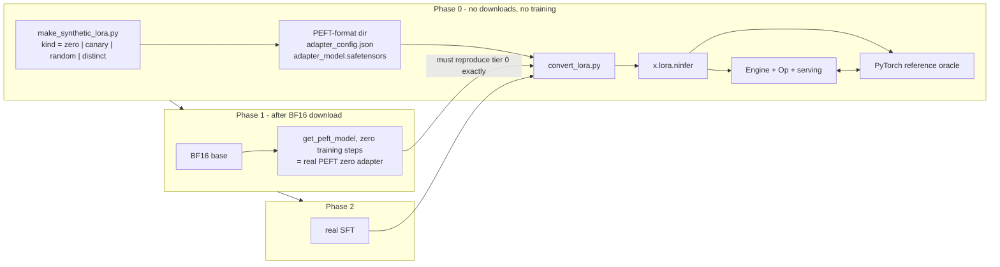

# Runtime LoRA adapters — Qwen3.8-27B

## Status and scope

Opened 2026-08-19; delivered 2026-08-20. This file **is** the current implementation map for
runtime LoRA. Every phase in §12 has landed and is exercised end to end on the real
`groupwise-int` artifact, from Unsloth training through conversion, banking, execution and
per-request serving.

It remains a transitional document. Its stable contracts still owe migration into the permanent
authorities listed at the end of this section, after which this file is deleted.

Deliverable: QLoRA adapters trained externally with Unsloth, converted to `.ninfer`, loaded
alongside the base artifact, and selected **per request by the OpenAI/Anthropic `model` string** —
`qwen3.8-27b` runs the unmodified base, `qwen3.8-27b-qlora-math` runs the base plus the `math`
adapter, with no reload between requests.

In scope:

- the adapter `.ninfer` contract and its converter;
- one new Op family that applies a low-rank correction with per-token adapter routing;
- resident multi-adapter banking, request routing, and prefix-reuse isolation;
- serving-side model-name routing and `/v1/models`;
- a synthetic-adapter bring-up ladder that validates all of the above **before** any checkpoint
  download or training run;
- the Unsloth training recipe and its constraints on this target.

Out of scope: adapters for `qwen3.6-35b-a3b`, adapter training inside NInfer, adapter merging into
base weights, runtime adapter add/remove after startup, and rank or target-module sets outside the
registered contract.

Pending migration: the adapter inventory belongs in `qwen3.8-27b-artifact.md`, the Op contract in
`op-development.md`, routing and prefix keying in `concurrent-inference-architecture.md`, and the
served surfaces in `serving.md` and `cli.md`. Once those absorb the contracts below, delete this
file.

## 1. Product-contract change

`AGENTS.md` currently states that the registered identities are `qwen3.8-27b/groupwise-int`,
`qwen3.8-27b/nvfp4`, and `qwen3.6-35b-a3b/groupwise-int`, and that `.ninfer` is the only C++ product
artifact. This work adds a **second artifact role** under the same container and a **second
resident weight source**, both explicitly registered. It does not add discovery, plugin loading,
string-driven execution, or runtime allocation.

Changes required in `AGENTS.md` when the work lands:

- "Current product contract" gains: the 27B target additionally accepts zero to eight registered
  LoRA adapter artifacts, fixed at startup, selected per request by name.
- "Product and ownership boundaries" gains: `tools/convert/qwen3_8_27b` owns adapter conversion;
  `src/ops/lora` owns the low-rank correction Op; the adapter bank is package-owned persistent
  state; serving owns the model-name route table.

Adapter registration is **explicit** (`--lora NAME=PATH`, repeatable). Directory scanning or
name-pattern discovery is not admitted.

## 2. Feasibility findings

### 2.1 The target is trainable

`qwen3.8-27b` converts from an HF checkpoint whose `model_type` is `qwen3_5` and whose
`architectures` is exactly `["Qwen3_5ForConditionalGeneration"]`
(`tools/convert/qwen3_8_27b/base_convert.py:37-46`, enforced at `:119`).

| Component | Version | Evidence |
|---|---|---|
| `transformers` | 5.5.0 | `models/qwen3_5/` present (`configuration_qwen3_5.py`, `modeling_qwen3_5.py`) |
| `unsloth` | 2026.8.18 | explicit `qwen3_5` handling |
| `peft` / `trl` / `bitsandbytes` | 0.18.1 / 0.23.1 / 0.50.1 | |
| torch | 2.11.0+cu130 | |

Interpreter: `/home/ubuntu/.unsloth/studio/unsloth_studio/bin/python`.

Unsloth routes `qwen3_5` through the generic `FastModel`/`FastBaseModel` path, not `FastQwen3Model`:

- `unsloth/models/loader.py:131` — `qwen3_5` is on the float16 blocklist ("Qwen3.5 GDN layers
  produce NaN grad norms in float16 training"). **Training must be bfloat16.**
- `unsloth/models/loader.py:269` — `FLA_MODEL_TYPE_PREFIXES = ("qwen3_next", "qwen3_5",
  "kimi_linear", "olmo_hybrid")`.
- `unsloth/save.py:717-729` — `_is_qwen3_5_vlm()` recognizes `Qwen3_5ForConditionalGeneration`.

### 2.2 HF module names and their NInfer destinations

From `transformers/models/qwen3_5/modeling_qwen3_5.py`:

| HF module | Line | Shape (27B) | NInfer object |
|---|---|---|---|
| `self_attn.q_proj` | `:632` | `[12288,5120]` — head-interleaved 256 query + 256 gate per head | `attention/query_key` rows + `attention/gate_value` rows |
| `self_attn.k_proj` | `:635` | `[1024,5120]` | `attention/query_key` rows |
| `self_attn.v_proj` | `:638` | `[1024,5120]` | `attention/gate_value` rows |
| `self_attn.o_proj` | `:641` | `[5120,6144]` | `attention/output` |
| `linear_attn.in_proj_qkv` | `:417` | `[10240,5120]` | `gdn/query_key` + `gdn/value_z` |
| `linear_attn.in_proj_z` | `:418` | `[6144,5120]` | `gdn/value_z` |
| `linear_attn.in_proj_b` / `in_proj_a` | `:419-420` | `[48,5120]` | `gdn/b_projection` / `gdn/a_projection` |
| `linear_attn.out_proj` | `:403` | `[5120,6144]` | `gdn/output` |
| `mlp.gate_proj` / `up_proj` | `:701-702` | `[17408,5120]` | `mlp/gate_up` |
| `mlp.down_proj` | `:703` | `[5120,17408]` | `mlp/down` |

### 2.3 Blockers and prerequisites

| # | Item | Status |
|---|---|---|
| B1 | BF16 Qwen3.8-27B checkpoint | **absent.** No `.safetensors` > 100 MB anywhere under `/home/ubuntu`; `~/.cache/huggingface/hub` holds only orphaned lock dirs for the AWQ and GGUF derivatives, which are unusable (`SOURCE_DTYPE = "BF16"` is a hard abort, `tools/convert/qwen3_8/common/recipe.py:22,319-321`). ~54 GB download. 145 GB free. **Required only for training (Phase 1+).** |
| B2 | `flash-linear-attention` (`fla`) and `causal_conv1d` | **present** (`fla-core` 0.5.2, `causal_conv1d` 1.7.0), but installing them is not sufficient — see the trap below. `is_fast_path_available` (`modeling_qwen3_5.py:205`) is `all()` over **four** symbols, so a broken `causal_conv1d` also disables the working `fla` GDN kernels and drops the recurrence onto `torch_chunk_gated_delta_rule` / `torch_causal_conv1d_update`. |
| B3 | `tools/reference/qwen3_8_27b/bindings.py:276,314` declares `text/token_embedding` and `text/output_head` as `Q6G64_F16S` | **defect.** The shipped artifact stores both as `W8G32_F16S` (verified against `models/qwen3_8_27b.ninfer`, 1,350,860,800 bytes each). The Python reference therefore cannot open the shipped artifact and raises `BindingError`. Stale leak from `base_inventory.py:48,91`. **Blocks the numerical oracle. Two-line fix, must land first.** |
| B4 | GPU | RTX 4090, 24 GB, `sm_89`, driver 610.57.04. Sufficient for the engine work; tight but workable for 27B QLoRA text-only at `seq ≤ 1024`. |

**B2 is installed-versus-enabled, and the difference is silent.** Both packages can import cleanly
while the fast path stays off, announcing itself only as `The fast path is not available because
one of the required library is not installed`. Unsloth widens the failure: at import,
`patch_causal_conv1d_cuda_probe` (`unsloth_zoo/temporary_patches/misc.py:946`) runs a tiny
`causal_conv1d_fn` forward and nullifies both entry points on *any* exception, printing
`causal_conv1d CUDA kernels not compatible with this GPU`. That message is written for "no kernel
image is available" on unsupported architectures, but it also fires on a wheel that merely
disagrees with the installed libtorch — which then takes `fla` down with it via the `all()` gate.

An ABI mismatch is the likely cause and is easy to misread: it fails on **every** dtype, `float32`
included, with `Expected input_type == at::ScalarType::Float || ... to be true, but got false`,
which reads like an unsupported-dtype error. A correctly built extension cannot reject all three of
its own supported dtypes. Ada is *not* the problem — released wheels carry no `sm_89` cubin, but
`sm_80` runs on 8.9 under CUDA minor-version forward compatibility, confirmed on this card.

Verify after importing unsloth, since the veto is Unsloth's import-time patch and not transformers':

```bash
python3 -c "import unsloth, transformers.models.qwen3_5.modeling_qwen3_5 as m; print(m.is_fast_path_available)"
```

Repair by compiling against the torch actually installed in that environment. `--no-cache-dir` is
load-bearing: without it pip silently reinstalls the same mismatched wheel from its cache, reporting
`Using cached ...whl` and never invoking `nvcc`.

```bash
CAUSAL_CONV1D_FORCE_BUILD=TRUE MAX_JOBS=$(nproc) python3 -m pip install \
    --no-build-isolation --no-deps --force-reinstall --no-cache-dir \
    --no-binary causal_conv1d "causal_conv1d==1.7.0"
```

Measured on this target at batch 32, fallback → fast path: steady-state decode 143.2 → 154.7 tok/s,
and the prefill-bearing warmup pass 56.6 → 94.3 tok/s, at an unchanged 19.79 GiB peak. Training is
a full-sequence forward/backward rather than a decode loop, so it sits nearer the second figure.

## 3. Scope decision — supported LoRA target modules

NInfer's fused Ops make two HF module families **structurally impossible** to correct with a
post-hoc additive delta. This is not an implementation shortcut; it is a property of where the
nonlinearity sits. The two vocabulary endpoints are also unregistered, but for different reasons;
they are listed separately at the foot of the table so the two categories are not confused.

| HF module | NInfer call site | v1 | Reason |
|---|---|:--:|---|
| `q_proj` (→ query + gate) | `ops::attn_input_proj` outputs `q_flat`, `gate_flat` | yes | plain BF16 destinations, read-modify-write |
| `k_proj`, `v_proj` | `k_flat`, `v_flat` | yes | same |
| `o_proj` | `ops::linear_add` into `x` (`variant.cpp:163-167`) | yes | already accumulates into the residual |
| `down_proj` | `ops::linear_add` into `x` (`variant.cpp:281`) | yes | same |
| `linear_attn.out_proj` | `ops::linear_add` into `x` (`variant.cpp:259-263`) | yes | same |
| `gate_proj`, `up_proj` | `ops::linear_swiglu` (`variant.cpp:278`) | **no** | the delta must land **before** `silu(g) * u`; `silu(g+dg)*(u+du)` is not decomposable into `silu(g)*u + f(dg,du)` |
| `in_proj_qkv`, `in_proj_z` | `ops::gdn_input_proj_conv_snapshot` (`variant.cpp:213-232`) | **no** | the delta must land **before** the fused causal conv **and** its SiLU. The conv is linear, but a separate delta path would need its own 3-tap persistent state per lane; the SiLU then blocks recombination. |
| `in_proj_a`, `in_proj_b` | `ops::gdn_norm_gating_proj` (`variant.cpp:265-272`) | **no** | `[48,5120]`, fused into the norm+gating leaf; negligible capacity |
| `lm_head` | `ops::linear` into `logits` (`text_context_impl.h:642,747,805,1278`) | **no** | **not structural.** The destination is already a plain contiguous BF16 `[248320,T]` and satisfies the `lora_delta_add` contract. Excluded because this site table and its object names are layer-indexed, and because `text/draft_head` is a row gather of `lm_head` — an unmirrored delta desynchronizes MTP proposals from the target |
| `embed_tokens` | `ops::embedding` (`text_context_impl.h:743,795,1256`) | **no** | a gather, not a matmul: no `[N,T]` destination exists for `B @ (A @ x)`. Needs a new Op computing `out[:,t] += B @ A[:,ids[t]]` |

Supporting the excluded families requires an optional additive-input parameter threaded through the
`linear_swiglu` and `gdn_input_proj*` epilogues across `q4`, `q5`, `w8`, and `nvfp4` — roughly six
kernel families times four codecs. That is a separate project.

The vocabulary endpoints are a different case: `lm_head` is a policy exclusion rather than a
structural one, and `embed_tokens` needs a new Op rather than a modified epilogue.
`tools/train/qwen3_8_27b/train_lora.py` carries the per-module role, cost and expected gain for all
four unregistered modules, and its `--extra-modules` flag trains them for a training-side
experiment; `convert_lora.py` still rejects the resulting adapter by name.

**Registered v1 target-module set:**

```
["q_proj", "k_proj", "v_proj", "o_proj", "down_proj", "out_proj"]
```

`out_proj` is `linear_attn.out_proj`; PEFT matches on the leaf name and it does not collide with
`self_attn.o_proj`. Together these cover the complete attention block in all 16 full-attention
layers, the down projection in all 64 layers, and the output projection in all 48 GDN layers.
`train_lora.py` targets all six, so a trained adapter carries the complete registered table.
`convert_lora.py` **hard-rejects** an adapter containing any excluded module rather than silently
dropping it, and derives the site set from the objects actually present, so a narrower adapter
converts but cannot share a bank with a complete one.

### 3.1 Registered sites

| Site id | Layers | `A` shape | `B` shape | Destination |
|---|---:|---|---|---|
| `attention/query` | 16 | `[r,5120]` | `[6144,r]` | `q_flat[6144,T]` |
| `attention/gate` | 16 | `[r,5120]` (shared with query) | `[6144,r]` | `gate_flat[6144,T]` |
| `attention/key` | 16 | `[r,5120]` | `[1024,r]` | `k_flat[1024,T]` |
| `attention/value` | 16 | `[r,5120]` | `[1024,r]` | `v_flat[1024,T]` |
| `attention/output` | 16 | `[r,6144]` | `[5120,r]` | `x[5120,T]` |
| `gdn/output` | 48 | `[r,6144]` | `[5120,r]` | `x[5120,T]` |
| `mlp/down` | 64 | `[r,17408]` | `[5120,r]` | `x[5120,T]` |

At `r=16`: **42,205,184 parameters**, **84.4 MB** BF16, **368 tensor objects** per adapter.

### 3.2 Why the table includes `gdn/output`

Only 16 of the 64 layers are full attention. Without `gdn/output` the adapted token-mixing path
reaches those 16 and the remaining 48 carry `mlp/down` alone, so three quarters of the model gets a
single adapted projection. The site was registered from the start but the trainer did not target it
until it was measured, which left trained adapters unable to share a bank with the project's own
7-site fixtures.

Adding it costs **+25.8 %** parameters (33,554,432 → 42,205,184), **+50 %** `lora_apply` calls per
step (96 → 144, because each GDN layer gains a second call), and the prefill throughput in §8.1.

Two paired A/B runs measured what it buys. Each holds rank, alpha, steps, seed, schedule and data
fixed so the site set is the only variable, both at `r=16` over a 120-step schedule:

| Probe | n | 6-site | 7-site | Paired result |
|---|---:|---|---|---|
| Register transfer | 185 | 0.9321 mean | 0.9236 | diff **−0.0085**, 95 % CI [−0.027, +0.009], sign test p = 0.26 |
| Held-out math accuracy | 100 | 32 % | **37 %** | 7 discordant wins vs 2, McNemar p = 0.18 |

Neither result is significant and they point in opposite directions. Register transfer is a null
with a tight interval, which is unsurprising: register is largely lexical and `mlp/down` already
covers all 64 layers, so the GDN correction has little to add there. Capability transfer leans
positive, as one would expect if the GDN output projection matters to sequence mixing rather than
to vocabulary, but nine discordant pairs cannot carry a claim.

So the table is complete because the registered contract says it is, and because the token-mixing
path should not be economized on in three quarters of the layers - not because a quality gain was
demonstrated. Do not cite these runs as evidence that a 7-site adapter is better; cite them as the
reason not to expect a large difference at `r=16` on a short schedule.

The register arm reused the `datasets/caveman_pirate` corpus and its scorer as a convenient paired
probe. It is **not** the persona measurement: it omits the two baselines, the per-stratum headline,
the competence and JSON gates, and the strength sweep, and it runs at a rank and schedule that
document specifies against. `docs/maintainer/qwen3.8-27b-persona-adapter.md` is the authority for
adapter influence; nothing here should be read as a result for it.

## 4. Adapter artifact contract

### 4.1 Container

Reuse the `.ninfer` v2 container **unchanged**. No new `NumericFormat`, no new `StorageLayout`, no
new `ResourceEncoding`: every object is `BF16` / `contiguous-le-v1`, rank 2, 256-byte aligned. The
existing reader, binder, materializer, and `typed_binding.cpp:65-81` handle it as-is.

```json
{"identity": {"model_id": "qwen3.8-27b", "weights_id": "lora-bf16"}, "objects": [...]}
```

The adapter carries **no frontend resources** — the tokenizer, chat template, and preprocessor
configs belong to the base artifact. This is why the SHA-256 pin table
(`tools/convert/qwen3_8_27b/convert.py:34-53`, enforced at `:107-116`) is irrelevant here: an
adapter never carries those six files, so a trainer's re-serialization of `tokenizer.json` cannot
break adapter conversion.

`model_id` is the **base** model id, not the served name. It is the load-time compatibility check.
The served name comes from `--lora NAME=PATH`, which is deployment configuration, not artifact
identity — the same precedent as `--model-id` (`src/serve/serve_options.cpp:203-207`).

### 4.2 Object names

```
text/layers/{l}/attention/query_gate/lora_a     [r,5120]     l in full-attention layers
text/layers/{l}/attention/query/lora_b          [6144,r]
text/layers/{l}/attention/gate/lora_b           [6144,r]
text/layers/{l}/attention/key/lora_a            [r,5120]
text/layers/{l}/attention/key/lora_b            [1024,r]
text/layers/{l}/attention/value/lora_a          [r,5120]
text/layers/{l}/attention/value/lora_b          [1024,r]
text/layers/{l}/attention/output/lora_a         [r,6144]
text/layers/{l}/attention/output/lora_b         [5120,r]
text/layers/{l}/gdn/output/lora_a               [r,6144]     l in GDN layers
text/layers/{l}/gdn/output/lora_b               [5120,r]
text/layers/{l}/mlp/down/lora_a                 [r,17408]    all 64 layers
text/layers/{l}/mlp/down/lora_b                 [5120,r]
```

A site absent from the adapter is absent from the artifact; the binder plans a null site and the Op
skips it. A partially-targeted adapter is valid.

### 4.3 Scale folding

`scale = lora_alpha / r`, or `lora_alpha / sqrt(r)` when `use_rslora` is true. It is folded into
`B` at conversion time. There is **no runtime scale parameter** — the engine never sees `alpha` or
`r` semantics, only bank geometry.

### 4.4 `q_proj` de-interleave

HF `q_proj.weight` is `[12288,5120]` viewed as `[24 heads, 512, 5120]`, rows `0:256` query and
`256:512` gate per head (`tools/convert/qwen3_8/common/recipe.py:110-125`). PEFT's `lora_B` for
`q_proj` is `[12288,r]`. Because `delta = B @ A`, row-slicing `B` row-slices `delta`, so the split
is exact:

```
B_hf.reshape(24, 512, r)
  [:, 0:256, :].reshape(6144, r)   -> attention/query/lora_b
  [:, 256:512, :].reshape(6144, r) -> attention/gate/lora_b
```

`lora_A` is emitted once as `attention/query_gate/lora_a` and bound by both sites.

### 4.5 Converter — `tools/convert/qwen3_8_27b/convert_lora.py`

```
python3 -m tools.convert.qwen3_8_27b.convert_lora --adapter <peft_dir> --out <x.lora.ninfer>
```

Requires no base checkpoint. Validates `peft_type == "LORA"`; rejects DoRA (`use_dora`), `loftq`,
`modules_to_save`, non-zero `lora_dropout` at inference, `bias != "none"`, and any target module
outside §3. Accepts both key prefixes, since `text_only=True` collapses the VLM wrapper:

```
base_model.model.model.language_model.layers.{l}.self_attn.q_proj.lora_A.weight
base_model.model.model.layers.{l}.self_attn.q_proj.lora_A.weight
```

PEFT convention: `lora_A.weight` is `[r, in_features]`, `lora_B.weight` is `[out_features, r]`.
Writes a `<out>.conversion.json` report mirroring `tools/convert/qwen3_8/common/conversion.py:187-243`.

## 5. Op contract — `ops::lora_delta_add`

New family `src/ops/lora/`, contract at `include/ninfer/ops/lora.h`.

```cpp
namespace ninfer::ops {

struct LoraSite {                       // one (A,B) pair, banked over adapters
    const void* a = nullptr;            // BF16 [rank, k], adapter-strided; nullptr => inactive
    const void* b = nullptr;            // BF16 [n, rank],  adapter-strided
    std::int32_t n = 0, k = 0;
    std::size_t a_adapter_stride = 0;   // bytes between consecutive adapters
    std::size_t b_adapter_stride = 0;
};

struct LoraGroup {                      // one launch; all sites share the same input x
    std::int32_t rank = 0;              // padded bank rank, one of {8,16,32,64}
    std::int32_t adapter_count = 0;
    std::int32_t site_count = 0;        // 1 or 4
    std::array<LoraSite, 4> sites{};
};

[[nodiscard]] std::size_t lora_delta_add_workspace_capacity_bytes(std::int32_t rank,
                                                                  std::int32_t site_count,
                                                                  std::int32_t min_tokens,
                                                                  std::int32_t max_tokens);

void lora_delta_add(const Tensor& x, const LoraGroup& group, const Tensor& adapter_index,
                    std::span<Tensor* const> destinations,
                    WorkspaceArena& workspace, cudaStream_t stream);

} // namespace ninfer::ops
```

Semantics, for every site `s` and every token column `t`:

```
a = adapter_index[t]
if a >= 0:  destination_s[:, t] += B_s[a] @ (A_s[a] @ x[:, t])
```

- `x` is contiguous BF16 `[K,T]`; every `destination_s` is contiguous BF16 `[N_s,T]` and is updated
  **in place**. `a < 0` contributes nothing to that column.
- `adapter_index` is I32 with `ne[0] == T` (per-column, decode/verify) or `ne[0] == 1` (uniform,
  prefill).
- Mixed adapter ranks are handled by **zero-padding `B` to the bank rank**; padded `A` rows then
  contribute exactly nothing. One compile-time bank rank, no per-adapter rank table.
- **`A16Only`.** BF16 operands, FP32 accumulation, BF16 store. INT8 activation profiles are not
  admitted: `Verify` is the phase CUDA Graphs capture and it must stay bit-identical to the A16
  catalog (`src/targets/qwen3_8_27b/impl/variant.cpp:65-80`).
- Oracle per `op-development.md`: one independent naive FP32 evaluation of
  `destination_in + B·(A·x)` from the represented BF16 inputs. Accumulator order, staging, and
  kernel decomposition are private.
- No persistent state. Workspace is caller-owned, graph-stable transient storage holding the
  `[rank, T]` intermediate per site.

The `attention/query` and `attention/gate` sites point at the **same** `A` object; the kernel
computes four independent `A`-projections rather than deduplicating. At `r=16`, `K=5120`, `T=8`
that redundancy is 655 K MACs — negligible against the `B` work, and it keeps the kernel uniform.

### 5.1 Precedent

`sparse_moe` is the closest existing analogue: "expert `e` directly selects its stored row spans;
no selected-weight gather or repack occurs" (`include/ninfer/ops/sparse_moe.h:53-54`). Adapter
banking is the same pattern with `adapter_index` in place of the router.

## 6. Engine integration

### 6.1 Why this is CUDA-Graph safe

Three existing mechanisms carry the whole design:

1. **Per-column routing already exists.** `lanes[B]` in `OrdinaryDecodeIngress`
   (`src/targets/qwen3_8/export/ninfer/targets/qwen3_8/round_state.h:31-38`) is a device-resident
   per-batch-row selector for GDN state. `adapters[B]` is byte-for-byte the same pattern.
2. **The H2D upload is inside the captured graph.** `decode_impl.h:20-22` copies the whole
   `OrdinaryDecodeIngress` from a fixed pinned host address every replay. Adding a field changes
   the struct, not the topology.
3. **Adapter count is startup-fixed**, so bank base pointers and strides are kernel constants and
   the bank lives in the persistent arena, which is one `cudaMalloc` with deterministic offsets
   (`src/core/arena.cu:189-214`).

**Maximal batched decode is preserved.** Mixed-adapter batches execute in one round; there is no
cohorting by adapter, so the §2.1 invariant in `concurrent-inference-architecture.md:60-63` is not
weakened.

**Zero cost when unused.** With no `--lora`, `StartupFeatures::lora_adapters == 0`, the LoRA leaves
are not emitted, and the captured graph is topologically identical to today. Base-model throughput
is provably unchanged.

### 6.2 Family runtime — `src/targets/qwen3_8/`

| File:line | Change |
|---|---|
| `export/ninfer/targets/qwen3_8/startup_features.h:7-26` | `+ std::uint32_t lora_adapters = 0;` and `bool lora() const noexcept`; populate in `startup_features(options)` at `:28-35` |
| `export/ninfer/targets/qwen3_8/round_state.h:31-38` | `+ std::array<std::int32_t, kMaximumConcurrency> adapters{};` in `OrdinaryDecodeIngress`; same in `MtpDecodeIngress` (`:46`) and `DFlashDecodeIngress` (`:72`) |
| `impl/state/round_state.cpp:81-110` | `+ adapters = ingress_tensor(offsetof(OrdinaryDecodeIngress, adapters), DType::I32);` |
| `impl/runtime/text_context.h:75-97` | `+ LoraSiteViews` on `FullLayerW`, `GdnLayerW`, `MlpW`; bind at `text_context_impl.h:262-318` |
| `impl/runtime/text_context_impl.h:811`, `:850`, `:955`, `:964` | insert `Variant::lora_*` calls guarded by `features.lora()` |
| `impl/runtime/layouts_impl.h` `attention_stage`/`gdn_stage`/`post_mixer_stage` | `+ scratch(layout, ...)` for the LoRA groups. The layout is frozen before any adapter artifact is read, so it is sized for `StartupFeatures::lora_sizing_rank`, which is `kMaximumLoraRank` whenever adapters are registered. The bank's executed rank lives on the model view. The difference is well under a MiB of transient scratch. The bank itself is not a `PersistentLayout` region: it is its own `DeviceArena` owned by `LoadedModelData`, committed before KV capacity is resolved so the authoritative resolver already excludes it |
| `impl/runtime/workspace_recipe.h` | `+ lora_intermediate<Config>(alloc, rank, site_count, T)`, mirrored into `layouts_impl.h` `attention_stage` / `gdn_stage` / `post_mixer_stage` (`:258-308`) so `WorkspaceLayoutBuilder` sizes it |
| `impl/runtime/program_impl.h:2640-2667` | fill `ordinary_host_ingress->adapters[row]` beside `lanes[row]` |

No new graph profiles. `ordinary_graph_profiles` (`variant.cpp:108-146`) and `topology_class` are
untouched.

### 6.3 Package — `src/targets/qwen3_8_27b/`

Three of the four correction points are ordinary family-level `ops::lora_delta_add` calls, because
their input activation and their destinations are already materialized in the family text schedule
next to `ops::rmsnorm` and `ops::rope`:

| Correction | Sites | Input | Destinations |
|---|---|---|---|
| attention projection | 4 | `h[5120,T]` | `q_flat`, `gate_flat`, `k_flat`, `v_flat` |
| attention output | 1 | `a[6144,T]` | `x[5120,T]` |
| GDN output | 1 | `on[6144,T]` | `x[5120,T]` |

The down projection is different and **must** live inside the package leaf. Its delta acts on the
SwiGLU activation, which `Variant::post_mixer` allocates from its own workspace scope between
`ops::linear_swiglu` and `ops::linear_add` and never exposes. The package therefore gains a peer
leaf, `Variant::post_mixer_lora`, which runs swiglu, the fused down/residual add, and then the
correction against the activation it still owns, plus a
`post_mixer_lora_workspace_capacity_bytes` query. The activation stays live across the correction,
so its bytes are additive rather than shared with the projection scratch.

LoRA support is a compile-time Variant trait, `static constexpr bool supports_lora`, in the same
shape as the existing `supports_dflash`. The 27B package sets it true; Qwen3.6-35B-A3B sets it
false, because its post-mixer is a sparse MoE whose down projection is per-expert and is not
covered by the registered additive site contract. That package needs no LoRA leaf, no stub, and no
runtime branch. Because `Variant` is a concrete typedef inside each instantiation rather than a
template parameter, the family routes the call through a `post_mixer_with_lora<V>` helper so the
discarded branch is genuinely dependent and never name-looked-up.

Adapter binding and bank residency live in `impl/load/lora_bindings.{h,cpp}`:
`bind_lora_artifact` discovers the rank from the first registered factor, binds the complete
inventory with exact shapes, and assigns each object a byte offset inside one adapter slab;
`load_lora_bank` validates identity, rank and inventory agreement across adapters, materializes
each one, and packs them **adapter-major** into a single `DeviceArena`. Every site's adapter
stride is then the same constant — the slab size — and every plane address is deterministic.
`Package::attach_lora` moves that bank into `LoadedModelData` and publishes the names.

### 6.4 Multi-artifact load — `src/targets/registry.cpp:82-134`

`construct_registered` calls `Target::attach_lora` between `construct_loaded_model` and the
authoritative `resolve_kv_capacity`. Because that resolution reads `current_free_device_bytes()`,
the committed bank is accounted for without a separate preflight term; the earlier preflight call
is a discarded sanity check on the base weights only. A foreign identity, a disagreeing rank or
inventory, a duplicate name, and more than `kMaximumLoraAdapters` entries all throw at load with
both identities or names in the message.

### 6.5 Public API — `include/ninfer/types.h`

```cpp
struct LoraAdapterSpec {                        // new
    std::string name;
    std::filesystem::path path;
};

// EngineOptions, types.h:107-124
std::vector<LoraAdapterSpec> lora_adapters;     // at most kMaximumLoraAdapters (8)

// ExecutionOptions, types.h:192-198
std::optional<std::string> adapter;             // nullopt => base weights only

// LoadSummary, types.h:619-630
std::vector<std::string> lora_adapter_names;
```

`resolve_request_options` (`src/runtime/engine/engine.cpp:24-35`) resolves the name to an index;
an unregistered name raises `RequestError`. The index is carried on
`ResolvedExecutionOptions` (`src/runtime/contract/types.h:24-28`) and reaches
`Request` (`src/runtime/engine/concurrent_executor.h:863`).

### 6.6 Prefix reuse and KV correctness

KV and GDN recurrent state produced under adapter A are **invalid** for adapter B. This is a
correctness requirement, not an optimization. Three mechanisms enforce it:

- `SequenceState::adapter` records which bank index produced a lane's continuation.
  `plan_request_for_lane` refuses resident-prefix reuse unless it matches the request, so a lane
  holding another adapter's state simply reports zero reusable tokens and is treated as a full
  reset. `find_admission_lane` needs no adapter-specific rule because it already ranks lanes by
  planned reusable tokens.
- Every continuation-cache alias is namespaced by adapter through `adapter_scoped_alias`, applied
  to both the session `routing_hint` and the stable-prefix alias. Scoping is unconditional,
  including the base weights, so no unscoped key exists and two adapters cannot collide.
  `import_continuation_lane` takes the requesting adapter and stamps it onto the restored
  sequence.
- `slot_model_binding` folds the registered adapter names into the slot digest, so a slot image
  cannot be restored into an engine with a different resident adapter set or bank order. The
  binding pins the *set*; the session record pins *which* of them produced the image. Snapshot
  version 2 carries `SnapshotSession::adapter`, written from `sequence.adapter` on save and
  assigned back on restore. Before that field existed the restored lane kept whatever adapter its
  previous occupant had left behind, which on a fresh lane is `-1`: a slot saved under an adapter
  restored as base, and the very next base request with a matching prefix reused adapter-encoded
  KV and GDN state. Because the binding already fixes the name list and its order, the index is
  sufficient identity and the target never has to learn adapter names.

### 6.7 Speculative decoding

MTP weights are separate (`mtp/*`) and carry no adapter. Target verify runs the adapted layers;
the draft does not. Acceptance rate therefore degrades on an adapted model by an amount
proportional to the adapter's effect. `MtpDecodeIngress` still needs `adapters[B]` because the
**target** pass is adapted. This is accepted and documented, not fixed, in v1.

Measured, with `--spec mtp --draft-tokens 3` on the 120-step math adapter over 8 held-out prompts
at a 96-token budget:

| Model | Rounds | Drafted | Accepted | Tokens/round | Accept rate |
|---|---:|---:|---:|---:|---:|
| base | 209 | 623 | 548 | 3.62 | **88.0%** |
| + adapter | 53 | 159 | 105 | 2.98 | **66.0%** |

Acceptance falls by about a fifth and the draft window yields 2.98 tokens per round instead of
3.62. This adapter is close to a worst case - its salient behaviour is a first-token flip on
essentially every prompt, which is exactly the argmax disagreement an unadapted draft cannot
predict - but the direction is structural, not specific to it.

Read the round counts as scale, not as a speed comparison: the arms do not generate the same text.
The adapted model answers in terse JSON and stops early, while the base model writes prose to the
96-token budget, so the base arm simply produces far more tokens. An adapter changes what the model
says, so no acceptance comparison between an adapted and an unadapted model can hold the output
distribution fixed. The operational claim - enabling an adapter costs acceptance - is unaffected.

Published MTP figures in `performance.md` are base-model figures and do not describe adapted
serving.

## 7. Serving and model routing

Adapter names are registered as bare names; the served model id for each is
`<public model id>-<name>`.

| File | Change |
|---|---|
| `src/serve/http_server.h` | `+ adapter_model_ids_` and `+ adapter_names_` beside `public_model_id_`; `+ resolve_model()` returning `std::optional<std::string>` (nullopt = 404, empty = base) |
| `src/serve/http_server.cpp` `attach` | build `adapter_model_ids_` from `load_summary().lora_adapter_names` |
| `src/serve/http_server.cpp` chat completions | exact-match 404 → `resolve_model`, writing `request.adapter` |
| `src/serve/http_server.cpp` `handle_model`/`handle_models` | `resolve_model` gate; `/v1/models` lists base + every adapter |
| `src/serve/openai_schema.{h,cpp}` | `make_models_list` takes the adapter model ids |
| `src/serve/request.h` | `GenerationRequest::adapter` |
| `src/serve/translate.cpp` | `options.execution.adapter = request.adapter` when non-empty |
| `src/serve/serve_options.{h,cpp}` | `--lora NAME=PATH`, repeatable, plus usage text |
| `src/serve/generation_service.cpp` | `engine_options.lora_adapters = options_.lora_adapters` |
| `apps/cli/options.{h,cpp}`, `apps/cli/main.cpp` | `--lora NAME=PATH` (repeatable) and `--adapter NAME` |
| `include/ninfer/types.h` | `RequestErrorKind::UnknownAdapter`, mapped to 404 `model_not_found` on `param: "model"` |

Still outstanding for the Responses and Anthropic surfaces: `responses_http.cpp` `validate_model`
and the Anthropic route, which must keep the documented "accept any Claude model name and echo it"
contract while resolving a registered adapter name when one matches.

```
ninfer-serve models/qwen3_8_27b.ninfer \
  --lora qlora-math=adapters/math.lora.ninfer \
  --lora qlora-python=adapters/python.lora.ninfer
```

`model: "qwen3.8-27b"` → base. `model: "qwen3.8-27b-qlora-math"` → adapter index 0. Anything else
→ 404 on the OpenAI surface.

## 8. Cost model

At `r=16`, all seven sites, per adapter:

| Quantity | Value |
|---|---|
| Parameters | 42,205,184 |
| VRAM | 84.4 MB (675 MB for 8 adapters) |
| Tensor objects | 368 |
| Extra kernel launches per decode step | 144 (16 full-attention layers × 3, 48 GDN layers × 2) |
| Extra bandwidth per decode step | 84.4 MB against an 18.2 GB base weight read — **0.46 %** |

Launch overhead is the term to watch, not bandwidth: 144 in-graph node launches at roughly
0.3–0.5 µs each is on the order of 50–70 µs against a decode step of roughly 19 ms — an estimated
**0.3–0.4 %**. That figure is a decode projection and has not been measured. Decode remains the
open half of this section; the published claim must come from `bench/targets/qwen3_8_27b` at `B=1`
and `B=8` with 0, 1, and 8 adapters registered.

Base requests served by a LoRA-enabled process pay the launch cost with `adapter_index = -1`,
because graph topology is fixed at capture. A process started without `--lora` pays nothing.

### 8.1 Prefill, measured

Prefill was outside the model above, and it is the larger term. RTX 4090 `sm_89`, one lane, KV
`rk4v4-e8`, `prefill_chunk` 1024, continuation cache off and prefix reuse disabled, one warm-up
request discarded, three repeats, `prefill_tok_s` from the structured request log. SM clock held
2715–2730 MHz at 465–475 W throughout, so no arm was throttled.

| Prompt tokens | No `--lora` | Bank resident, base request | Adapter selected |
|---:|---:|---:|---:|
| 9,411 | 3600 tok/s | 3601 tok/s | 3307 tok/s (**−8.2 %**) |
| 37,798 | 3250 tok/s | 3247 tok/s | 3017 tok/s (**−7.1 %**) |

Within-arm spread was ≤1 %, so both effects are outside the noise. These are the complete 7-site
table. The same protocol against a 6-site adapter, which omits `gdn/output` and so issues 96
`lora_apply` calls per step instead of 144, gives 3360 and 3054 tok/s, so the GDN correction across
48 layers accounts for a further **1.2–1.6 %**. A 50 % increase in launches costing under 2 % is
consistent with launch overhead being amortized across a 1024-token chunk.

Two results. A resident but unselected bank costs nothing measurable in prefill — the 144 extra
launches amortize over a 1024-token chunk instead of a single decode step. And selecting an
adapter costs about **6 %** of prefill throughput, roughly an order of magnitude more than the
decode projection above.

That 6 % is not explained by arithmetic. At `r=16` the added work is `2·T·r·(in+out)` against a
base `2·T·in·out`, which for these shapes is under 1 % of the adapted GEMMs' FLOPs. The cost is
shape: a rank-16 GEMM is extremely skinny, so both halves are dominated by streaming the `[T, in]`
activation in and the `[T, out]` result out rather than by the multiply, and the prefill base GEMMs
they are compared against are the fast A8 route. Anyone trying to close this gap should attack
activation traffic — fusing the correction into the base epilogue — not the FLOPs.

## 9. Synthetic adapter ladder

A LoRA `A`/`B` pair is **independent of base weights** — only shapes matter, and those are fixed
constants for this target. A synthetic adapter therefore needs no checkpoint download, no GPU
training, and no Unsloth. Together with the already-present `models/qwen3_8_27b.ninfer` and
`build-sm89/`, this decouples the entire engine implementation from blockers B1 and B2.



The generator emits **PEFT-format** directories rather than `.ninfer` directly, so the fixtures
exercise `convert_lora.py` as well. Converter bugs are caught, not baked in.

### 9.1 Generator — `tools/convert/qwen3_8_27b/make_synthetic_lora.py`

```
python3 -m tools.convert.qwen3_8_27b.make_synthetic_lora \
    --kind zero|canary|random|distinct --variant a|b \
    --rank 16 --alpha 32 --seed 3407 --out out/synthetic/<name>
```

`alpha != r` is deliberate: `scale = alpha / r = 2.0` exercises the fold of §4.3. A canary carrying
`c = 1.0` must produce a delta of exactly `2.0` — never `1.0` (fold omitted) and never `4.0` (fold
applied twice).

Fixtures are generated at test time and are not committed; a full `r=16` adapter is 84 MB. The Op
unit test builds its bank in memory and needs no artifact at all.

### 9.2 Tier 0 — `zero` (no-op)

Exactly what `get_peft_model()` produces before any optimizer step:

```
lora_A = Kaiming-uniform    (nonzero, so the A-projection is genuinely exercised)
lora_B = 0                  (exactly zero)
delta  = B @ A = 0
```

`B = 0` rather than `A = 0` because it is the real PEFT initialization, so Phase 1 can produce a
byte-comparable adapter from the true pipeline.

| Check | Criterion |
|---|---|
| Greedy generation, ≥ 256 tokens, against base | **exactly identical token sequence** |
| Logits against base | identical, treating `+0.0` and `-0.0` as equal |
| Captured decode graph | LoRA nodes **present and launched** |

The `±0` allowance is precise, not a hedge. `dest += 0` is exact for every finite value, but an
FP32 accumulator that ends at `+0.0` turns a `-0.0` destination into `+0.0`. Nothing downstream
distinguishes them: `rmsnorm` and `gated_rmsnorm` divide by `sqrt(mean + eps)` with `eps = 1e-6`,
and the schedule contains no `copysign`, `atan2`, or reciprocal of an activation.

The third row is what keeps the test from being vacuous. A zero adapter that silently skips the
kernel proves nothing; assert a nonzero LoRA node count in the captured graph
(`tests/test_decode_graph.cpp` has the machinery).

### 9.3 Tier 1 — `canary` (analytically known delta)

Rank-1 one-hot per site:

```
A[0, k0] = 1,  all else 0          # select input channel k0
B[n0, 0] = c,  all else 0          # write to output channel n0
=> delta[n0, k0] = c * scale, every other entry exactly 0
=> destination[n0, t] += c * scale * x[k0, t]
```

with `(n0, k0)` derived from `(layer, site_id)` so that every site in the model has a distinct
signature — for example `k0 = (layer * 7 + site_id) % K`, `n0 = (layer * 13 + site_id * 101) % N`.

This is the highest-value tier. A single scalar comparison localizes every orientation bug that a
random adapter reports only as "the numbers differ":

- `A` and `B` transposed;
- `N` and `K` swapped in the bank stride;
- delta routed to the wrong destination among query / gate / key / value;
- wrong layer offset within the bank;
- missing or doubled scale fold;
- `q_proj` de-interleave errors.

**The `q_proj` de-interleave canary is the single most valuable test in the plan.** A canary placed
at HF `lora_B` row `p` must land at:

```
head = p // 512;  within = p % 512
within <  256  ->  attention/query/lora_b  row  head * 256 + within
within >= 256  ->  attention/gate/lora_b   row  head * 256 + (within - 256)
```

Sweep `p ∈ {0, 255, 256, 511, 512, 767, 6143, 6144, 12287}` — both halves, both sides of a head
boundary, and both ends of the matrix. A naive `[:6144] / [6144:]` split fails on `p = 256`.

### 9.4 Tier 2 — `random`

`A, B ~ N(0, σ)` with `σ` chosen so the delta is roughly 1–5 % of base activation magnitude: large
enough to be unambiguous, small enough that the model still emits coherent text. Purpose is
dense-path agreement against the independent naive FP32 oracle at the real shapes
`[r,5120]×[6144,r]`, `[r,5120]×[1024,r]`, `[r,6144]×[5120,r]`, `[r,17408]×[5120,r]`, over
`T ∈ {1..8, 1024}`.

### 9.5 Tier 3 — `distinct` pair (routing)

Two canaries with different constants and different `(n0, k0)`. This is the most important tier for
the feature as a whole, because per-column adapter routing is the one genuinely novel mechanism.

| Test | Setup | Criterion |
|---|---|---|
| Op-level routing | `adapter_index = [-1, 0, 1, 0]` | column 0 unchanged; columns 1 and 3 carry canary A; column 2 carries canary B — all exact |
| Mixed decode batch | 4 concurrent requests: base, math, python, math | identical output to 4 sequential single-adapter runs |
| Prefix-reuse isolation | identical prompt to adapter A, then to adapter B | the second request must not reuse KV; `reused_prompt_tokens == 0` |
| Bank indexing | 8 adapters registered, request only index 7 | delta matches adapter 7, not adapter 0 |
| Uniform vs per-column | prefill (`ne[0] == 1`) and decode (`ne[0] == T`) | same delta for the same adapter |

## 10. Verification

| # | Layer | Requires | Location |
|---|---|---|---|
| 1 | Op unit test — tiers 1/2/3 against the FP32 oracle, bank built in memory, including `adapter_index < 0` | GPU only | `tests/ops/test_lora_delta_add.cpp` and `tests/ops/lora/`, following `tests/ops/op_check.h` and `op_tester.h` |
| 2 | Converter — synthetic PEFT → `.ninfer`, object inventory, decoded values, rejection of excluded modules | nothing | `tests/targets/qwen3_8_27b/` |
| 3 | Reference vs engine — a trained adapter, applied at the same sites, read from the PEFT directory so a converter fault cannot be inherited | BF16 checkpoint, a PEFT adapter | `tools/reference/qwen3_8_27b/lora.py`, `--lora` on `cli.py` |
| 4 | Engine — a trained adapter moves the **first** greedy token; a zero adapter does not, and does not leak; a mixed-adapter decode batch matches sequential runs; prefix reuse is isolated in both directions; multimodal prefill applies the adapter; a saved slot keeps its adapter identity; an adapted long prefill fits the workspace; a `gdn/output`-only adapter moves the output, isolating the correction on the 48 GDN layers | `models/qwen3_8_27b.ninfer`, two co-registerable adapters, and a one-site GDN fixture | `tests/targets/qwen3_8_27b/test_engine_lora_real.cpp` |
| 5 | Serving — `/v1/models`, 404 on unknown, routing, mixed batch, prefix isolation | `models/qwen3_8_27b.ninfer` | `tests/test_serve_options.cpp`, `test_openai_schema.cpp`, live server |
| 6 | Performance | GPU, quiet box | `bench/targets/qwen3_8_27b` at `B ∈ {1,8}` with 0/1/8 adapters |

Register new C++ tests through `ninfer_add_test(...)` in `tests/CMakeLists.txt:9-32`. The
real-artifact tests in `tests/targets/qwen3_8_27b/` read `NINFER_QWEN3_8_27B_WEIGHTS` and skip with
exit 77 without it; layer 4 additionally needs `NINFER_QWEN3_8_27B_LORA_ZERO`,
`NINFER_QWEN3_8_27B_LORA_TRAINED` and `NINFER_QWEN3_8_27B_LORA_GDN_ONLY`. The first two must share
one inventory; the third is a one-site fixture built with
`make_synthetic_lora.py --kind random --sigma 0.2 --sites gdn/output` and gets its own Engine.

Layer 4 exists because the coverage claim that used to stand here was false. It read: a zero adapter
reproduces the base byte-identically while a dense adapter diverges, therefore "the correction is
applied where it should be." It does not follow. A correction that is *suppressed* is
indistinguishable from one that is *zero*, so the zero arm can never detect a missing application;
and the dense arm only requires the delta to land somewhere, which the decode path satisfied on its
own. A defect that suppressed the adapter through all of prefill passed every LoRA test in the tree.

Two properties of layer 4 matter, and both were established by disabling the fix and re-running:

- **One greedy token, not a completion.** The first token is the argmax of the logits the prefill
  chunk produced, so it moves only if prefill itself ran adapted. Comparing a long completion does
  not work: the decode steps diverge on their own and mask the defect.
- **A trained adapter, not a synthetic one.** The `random` tier is unstructured noise; measured on
  the real artifact it does not move a confident argmax at all, so it cannot serve as a behavioural
  probe. Its numerics are already covered by layer 1. Only an adapter with a learned behaviour
  gives the first token a direction to move in.

Because all adapters in one bank share a rank and a site inventory, the zero arm must come from the
same inventory as the trained arm — a 7-site synthetic beside a 6-site trained adapter is rejected
at load. A zero-step PEFT adapter converted through the normal path satisfies this, and
`make_synthetic_lora.py --sites` generates matching synthetics when a fuller bank is wanted.

Every check in layer 4 was confirmed by reverting the code it guards and observing the failure;
each is written so the arm that fires is the arm that matters. Three properties turned out to be
load-bearing, and each is a way an earlier version of this test would have passed while broken:

- **Retire lanes at different rounds.** The ingress is filled over a compact `row` index into the
  active lane list. While that list is `{0,1,2,3}` the row equals the lane id, so indexing by the
  wrong one is invisible; four equal-length requests prove nothing. Staggered output lengths make
  the sets diverge.
- **Give each reuse direction its own prompt.** `allow_prefix_reuse` gates only whether a request
  *consumes* reuse, not whether it leaves a prefix behind, so an arm that shares a prompt with an
  earlier same-adapter request will reuse legitimately and look like a leak.
- **Restore into a lane that did not produce the image.** The producing lane already carries the
  right adapter, so restoring into it passes whether or not the identity was persisted.

What that coverage found, beyond the prefill defect it was written for:

| Defect | Symptom | Cause |
|---|---|---|
| Vision × LoRA use-after-reset | `cudaErrorIllegalAddress` in the GDN recurrent kernel on any adapted multimodal request | `bind_uniform_adapter` allocated the selector from the shared arena, then the Vision encode reset that arena when it finished an item, leaving the bank indexed by whatever later allocation reused those bytes |
| Slot restore loses adapter identity | a base request reusing adapter-encoded KV after a restore | `SnapshotSession` had no adapter field; the restored lane kept its previous occupant's value |
| Unreserved selector in the workspace plan | `std::bad_alloc` on every adapted request at long context and one lane, while base succeeded | the plan reserved LoRA *scratch* but not the per-chunk selector; 256 bytes after alignment, against a capacity fitted exactly to the plan |

The last one is the reason layer 4 builds a second, deliberately minimal Engine. With several lanes
or Vision enabled the decode stages dominate the workspace peak and leave prefill enough slack to
absorb an unreserved allocation; only at one lane with no Vision is text prefill itself the peak.
That configuration is also the product default, so the defect affected the most ordinary way to run
an adapter at long context.

The B3 defect that once blocked layer 3 is fixed: `tools/reference/qwen3_8_27b/bindings.py:276`
and `:314` now read `W8`, matching `WeightsProfile::GroupwiseIntW8Endpoints`.

## 11. Training recipe

Prerequisites: B1 (BF16 checkpoint) and B2 (`fla`, `causal_conv1d`) — and for B2, confirm the fast
path is actually *enabled*, not merely installed (section 2.3).

An earlier revision predicted the GDN torch fallback would "very likely exceed 24 GB even at
`seq = 1024`". Measurement refutes that: the entire 200-step GRPO run of section 11.1 executed on
the fallback at `max_seq_length = 1024` and peaked at 20.07 GiB, and rollout generation at 32
concurrent sequences peaked at 19.79 GiB on both paths. The fallback's cost is throughput, not
capacity, and the fast path does not lower the peak — so B2 is a speed prerequisite, and
`max_seq_length` remains the memory control.

```python
import unsloth                                   # must precede transformers
from unsloth import FastModel

model, tok = FastModel.from_pretrained(
    "/path/to/Qwen3.8-27B",
    max_seq_length = 1024,                       # 2048 is risky on a 24 GB 4090
    load_in_4bit   = True,
    text_only      = True,                       # skip the vision tower
    dtype          = None,                       # bfloat16; fp16 is blocked for qwen3_5
)

model = FastModel.get_peft_model(
    model,
    r = 16, lora_alpha = 32, lora_dropout = 0.0, bias = "none",
    target_modules = ["q_proj", "k_proj", "v_proj", "o_proj", "down_proj", "out_proj"],  # section 3
    use_gradient_checkpointing = "unsloth",
    use_rslora = False, loftq_config = None, random_state = 3407,
)

# SFTConfig: per_device_train_batch_size=1, gradient_accumulation_steps=8,
#            learning_rate=2e-4, optim="adamw_8bit", lr_scheduler_type="linear", seed=3407

model.save_pretrained("out/adapters/math")       # adapter only
```

VRAM estimate at `r=16`, `seq=1024`, `bs=1`: NF4 weights ≈ 15.5 GB, LoRA parameters + gradients +
8-bit optimizer state ≈ 0.25 GB, activations with Unsloth gradient checkpointing ≈ 1.5–3 GB, CUDA
and cuBLAS overhead ≈ 1–2 GB. Roughly 20–22 GB of 24 GB. Reduce `max_seq_length` first if it does
not fit.

**Do not use `save_pretrained_merged`.** Two independent reasons:

1. NInfer never needs a merged checkpoint — `convert_lora.py` consumes the adapter directly.
2. It would not work anyway. `model.save_pretrained_merged` is bound to
   `unsloth_generic_save_pretrained_merged` (`unsloth/save.py:7923`), which calls
   `merge_and_overwrite_lora` (`unsloth/save.py:6395-6410`). That function resolves a 16-bit
   sibling **by Hub name** through `INT_TO_FLOAT_MAPPER`
   (`unsloth_zoo/saving_utils.py:2911`), which has no Qwen3.8 entry, and hard-raises when the
   resolved base is nf4 and `merged_16bit` was requested (`saving_utils.py:2933-2939`).

For completeness: merging is also numerically undesirable here. For every model type outside
`_DEQUANT_MERGE_BASE_MODEL_TYPES = frozenset({"falcon_h1"})` (`saving_utils.py:193`), Unsloth folds
the adapter onto the downloaded `W16`, not onto `dequant(W4)` that training actually saw.

### 11.1 Reinforcement learning — `tools/train/qwen3_8_27b/train_grpo.py`

GRPO against a programmatic verifier, producing an adapter that converts and banks exactly like an
SFT one: same six modules, same seven sites, 42,205,184 parameters and 368 objects at `r=16`.

Rollouts run through the training model (`fast_inference=False`). That is Unsloth's documented
route for this architecture, and it is also the only correct one available. vLLM does register
`Qwen3_5ForCausalLM` with `SupportsLoRA`, but no vLLM that knows `qwen3_5` is co-installable with
Unsloth: `unsloth 2026.8.19` pins `torch<2.12` and `transformers<=5.5.0`, and resolving against
those caps yields vLLM 0.11.0 (with `transformers==5.5.0`) or 0.23.0 (unpinned, `transformers`
4.57.6), both of which predate the architecture. Generating from the training model is not a
concession: the behaviour policy *is* the target policy, so the importance ratio is exact, and the
adapter is applied at the same seven sites during generation and during the gradient step. A
separate engine could not be, which is also why NInfer cannot serve rollouts — its `groupwise-int`
weights differ from the trained NF4 base by `E = 0.1073` against an adapter norm of `‖BA‖ = 0.0079`
(section "Base-quantization mismatch"), a discrepancy roughly thirteen times the signal.

Two implementation facts are load-bearing on this target.

`text_only=True` collapses the model onto `Qwen3_5TextConfig`, which carries no `architectures`.
`unsloth/models/vision.py:548` iterates that field unconditionally on the generate path, so every
rollout raises `TypeError: 'NoneType' object is not iterable`. SFT never reaches it because SFT
never generates. `clear_generation_max_length` addresses a second one: Qwen3.8 carries
`max_length = 262144` on its runtime generation config, and `transformers/generation/utils.py:2339`
therefore reports a `max_new_tokens`/`max_length` clash on every single generate() call.

**Task selection is the decisive design step, and accuracy is the wrong statistic.** GRPO's
advantage is a within-group z-score, so a problem whose `--group` samples all score alike
contributes exactly zero gradient. What predicts trainability is the fraction of groups that are
*not* unanimous. Measured on this base at `--group 4`, thinking-off, 16 problems per row:

| task | mean reward | fully solved | informative groups |
|---|---:|---:|---:|
| `mini_sudoku` 4–6 empty | 0.626 | 0.516 | 0.750 |
| **`mini_sudoku` 6–8 empty** | **0.266** | 0.125 | **0.938** |
| `mini_sudoku` 8–10 empty | 0.191 | 0.109 | 0.938 |
| `maze` d3–5 g5–6 | 0.203 | 0.203 | 0.438 |
| `maze` d5–10 g5–10 | 0.062 | 0.062 | 0.125 |
| `n_queens` remove 1–2 / 2–4 / 4–7 | 0.000 | 0.000 | 0.000 |

`n_queens` scores exactly zero at every difficulty tried, including removing only one or two
queens. It is unlearnable here in the strict sense — no sampled completion is ever correct, so
there is nothing to reinforce — and it is also the task most likely to be chosen by inspection.
`--calibrate` reports both columns before a run commits hours to a task.

Measured run: `mini_sudoku` at 6–8 empty cells, `r=16`, `G=4`, 200 steps, `--beta 0`
(no reference pass), `--generation-batch 16`, 512 problems, lr 5e-6. Peak **20.07 GiB of 23.54**,
about 8.2 s/step, 56 minutes wall. Sampled training reward rose from 0.486 to 0.740 (first and
last ten logged groups).

Held out to a seed the run never saw, 64 problems, greedy, both arms on the same NF4 base with the
adapter toggled rather than reloaded:

| arm | mean | solved | mean completion tokens |
|---|---:|---:|---:|
| base | 0.6029 | 28/64 (0.438) | 61.1 |
| adapter | 0.8624 | 35/64 (0.547) | 30.9 |

Adapter better on 22 problems, worse on 1, tied on 41; sign test on the 23 discordant pairs gives
two-sided `p = 5.7e-06`.

Read that gain carefully. A large part of it is format compliance rather than solving ability:
mean completion halves, and served through NInfer the *base* scores 0.044 against the adapter's
0.645 mainly because the base narrates a step-by-step derivation and is cut off by the token
budget before it emits a grid, while the adapter emits the bare grid. The verifier rewards a
correctly formatted answer, so RLVR optimized the whole observable behaviour, not the arithmetic
alone. The matched-format comparison above — where the base does answer concisely — is the
defensible capability claim, and it is the smaller of the two numbers.

`mask_truncated_completions` is off by default for the same reason. A correct grid terminates in
about 32 tokens, so a completion that runs to the cap has failed the task's own format
instruction and its zero reward is real signal; masking it measured 50–75% of samples discarded,
which collapses the effective group size.

## 12. Phasing

| Phase | Gate | Blocked by |
|---|---|---|
| **0a** | Fix B3; add `make_synthetic_lora.py` and `convert_lora.py`; converter tests green | **done** — 31 tests |
| **0b** | `ops::lora_delta_add` plus Op unit tests, tiers 1/2/3 | **done** — mutation-checked suite |
| **0c** | Engine wiring — features, ingress `adapters[B]`, resident bank, correction points, request plumbing | **done** |
| **0d** | Prefix/lane/slot isolation, CLI and serving routes, `/v1/models` | **done**, all four surfaces |
| **1** | Install `fla` and `causal_conv1d`; `get_peft_model()` with **zero training steps** → real PEFT zero adapter → must reproduce tier 0 exactly | **done** |
| **2** | Real SFT; convert; serve | **done** |
| **3** | Reference LoRA path (§10 layer 3); prefill-application defect found and fixed; engine matches the reference | **done** |

Phase 0 evidence, on the real 18.2 GB `groupwise-int` artifact with three synthetic adapters
resident:

- a converted `.lora.ninfer` whose `B` is exactly zero is loaded, banked and executed, and its
  greedy output is **byte-identical** to the base — the zero-cost and correctness floor;
- the same run with a dense random adapter **diverges**, so the correction reaches execution —
  note that this does *not* establish it reaches every phase, which is the inference that
  concealed the prefill defect for two phases; see §10;
- with three adapters registered, a request naming no adapter and a request naming the zero
  adapter both reproduce the base output exactly, while bank index 2 diverges — the banked stride
  addressing is correct;
- unregistered name, foreign artifact identity, duplicate name and malformed `--lora` each fail
  with a specific message;
- `ctest`: 92/92, including `ninfer_qwen3_8_27b_prefix_real_test` against the real artifact.

Phase 1 was the seam test that proves Unsloth's on-disk key naming matches what `convert_lora.py`
expects. `FastModel.from_pretrained(text_only=True)` does collapse
`model.language_model.layers.N.*` to `model.layers.N.*`, and PEFT emits
`base_model.model.model.layers.N.<module>.lora_{A,B}.weight`, which the converter accepts. A
zero-step adapter converted to 272 objects / 33,554,432 parameters and reproduced the base output
**byte-identically** through the engine, so the training toolchain and the artifact contract agree.

Phase 2 trained a real adapter and served it. Recipe and outcome:

| Item | Value |
|---|---|
| base | `models/Qwen3.8-27B` BF16, frozen at bitsandbytes NF4 |
| data | `unsloth/OpenMathReasoning-mini`, `cot[:1000]`, rendered through the model's own chat template |
| shape | `r=16`, `alpha=32`, 6 sites, 33.5M trainable of 26.93B (0.12%) |
| schedule | 120 steps, bs 1 × accum 8, lr 2e-4, `adamw_8bit`, linear, seed 3407, `max_seq_length` 1024 |
| cost | 22 min wall, **17.9 GiB** peak of 24 GiB, ~11 s/step, 96% SM at ~478 W |
| result | train loss 0.688 → 0.435 |

The trained adapter converts to the same 272-object inventory and **changes greedy output** where
the base and the zero adapter agree exactly. Serving evidence, one process, three model ids, no
reload between requests:

- `/v1/models` lists `qwen3.8-27b`, `qwen3.8-27b-math`, `qwen3.8-27b-zero`;
- `/v1/chat/completions` with `qwen3.8-27b-zero` is byte-identical to the base, `qwen3.8-27b-math`
  diverges, and the two interleave in one process — hot swap with no reload;
- `/v1/responses` routes identically, and `/v1/models/{id}` answers 200 for an adapter;
- an unknown `model` returns 404 `model_not_found` with `param: "model"` on chat, responses and
  `/v1/models/{id}`;
- `/v1/messages` still accepts an arbitrary Claude model name and echoes it — the Anthropic
  contract is unchanged — while an adapter id routes to that adapter.

Two operational notes worth keeping. All registered adapters must share one site inventory as well
as one rank; registering a 7-site synthetic beside a 6-site trained adapter is rejected at load
with an explicit message. And `FastModel.from_pretrained` returns a `Qwen3VLProcessor`, not a bare
tokenizer, so a positional `tokenizer(text)` call is interpreted as *images*; use `text=` or
`processor.tokenizer`.

### Base-quantization mismatch — measured, then refuted

The behavioural non-transfer recorded below was real, reproducible, and **not** caused by the
base-quantization mismatch. It was an engine defect: prefill never bound the selected adapter. The
measurement and its refutation are both kept here, because the mismatch is still a genuine property
of the training setup and the false attribution is the reason the defect survived a green test
suite. **Skip to "What it actually was" for the conclusion.**

An adapter is fitted with the frozen base held at bitsandbytes NF4 but served on top of the
`groupwise-int` artifact. Recovered from the live loader, training holds the base at `nf4`,
blocksize 64, **double-quantized scales** (nested blocksize 256), bf16 compute. The served base
uses symmetric uniform codes against exactly-stored FP16 scales at the same group size, and is
**Q5 at four of the six sites** — finer than NF4 — and Q4 at query and key. `q_proj` straddles
both, its query half served from a Q4 matrix and its output-gate half from a Q5 one.
`train_lora.py` now records this in `training_report.json`; neither the PEFT config nor the model
config carries it.

`tools/parity/qwen3_8_27b/lora_transfer.py` measured the 120-step math adapter over 60 held-out
prompts at a 48-token greedy budget, with the prompt surface verified identical on both runners
(75 prompt tokens each, matching `enable_thinking=False`):

| Arm | Opens a reasoning block | Replies identical to its own base |
|---|---:|---:|
| `groupwise-int`, no adapter | 0% | — |
| `groupwise-int` + adapter | **0%** | 40.0% |
| NF4, no adapter | 0% | — |
| NF4 + adapter | **100%** | 0.0% |

The adapter was trained on chain-of-thought solutions, so emitting `<think>` is its single most
salient learned behaviour. On the base it was fitted against it did so on every prompt. On the base
it is served on it never did, and left 40% of replies byte-identical to no adapter at all. The
effect did not transfer.

That 40% figure is the tell, and it was misread at the time. A perturbation large enough to suppress
the adapter's most salient behaviour on every prompt should not leave two replies in five *exactly*
unchanged. Partial application explains both numbers at once; a base difference explains neither
cleanly.

Three confounds were eliminated before accepting this. The prompt is identical on both paths. The
adapter is verifiably attached on both, with 128 `lora_A` modules and a maximum next-token logit
change of 8.34 on the NF4 path. And NInfer neither hides reasoning in a separate response field —
the message carries only `content` and `role` — nor suppresses the token, as no logit banning
exists anywhere in `src/ops` or `src/targets`; thinking affects prompt construction only.

Measured relative Frobenius error against the true BF16 weight, at four sites:

| site | `e_g` served | `e_n` trained-on | `E = Q_g - Q_n` | `BA` |
|---|---:|---:|---:|---:|
| layer 3 attention/output | 0.0525 | 0.0937 | 0.1073 | 0.0079 |
| layer 3 mlp/down | 0.0508 | 0.0923 | 0.1055 | 0.0069 |
| layer 63 attention/output | 0.0573 | 0.0965 | 0.1119 | 0.0089 |
| layer 63 mlp/down | 0.0546 | 0.0946 | 0.1091 | 0.0101 |

The served base is about 1.8x **more** accurate than the base the adapter was fitted against —
these are Q5 sites, and 5-bit uniform with exact FP16 scales beats 4-bit NF4 with double-quantized
scales. The two errors are orthogonal: sqrt(0.0525^2 + 0.0937^2) = 0.1074 against a measured
0.1073. The unmodeled perturbation is roughly 13x the adapter's own norm.

A mechanism consistent with the norm table is that the adapter partly learned to compensate the
specific quantization error of its own frozen base, and that emitting a reasoning block is a
near-threshold first-token decision a base difference can flip. That was the working hypothesis, and
it was wrong.

#### What settled it

Three confounds had been eliminated — prompt equality, adapter attachment on the NF4 path, and the
absence of any reasoning-token suppression in `src/ops` or `src/targets`. A fourth had not: an error
anywhere between the PEFT checkpoint and the applied delta produces the same observation. Two
independent checks closed it, in the order that isolates the most code:

1. **Converter** (`scale·B@A` from the PEFT directory against the artifact's `lora_a`/`lora_b`
   product, every site of an attention layer and a GDN layer): all sites match at a relative error
   of 0.0016–0.0022, which is BF16 rounding. The scale fold, the `B` orientation and the `q_proj`
   de-interleave are all correct.
2. **Layer 3 of §10** — a reference LoRA path (`tools/reference/qwen3_8_27b/lora.py`) that reads
   the **PEFT directory directly**, so a converter fault cannot be inherited, applied at the same four
   correction points on the same `groupwise-int` base. Result: `ref_base` opens 0/3 reasoning
   blocks, matching NInfer's base, and `ref_adapter` opens **3/3**, matching the NF4 path
   character-for-character.

The adapter therefore transfers across the base-quantization difference perfectly well. The
`groupwise-int` base reproduces the trained behaviour when the delta is actually applied. NInfer was
not applying it.

#### What it actually was

`TextContext::set_adapter` — the setter for the scalar bank selector that prefill reads through
`bind_uniform_adapter` — **had no caller anywhere in the tree**. `uniform_adapter_` therefore kept
its initializer of `-1`, `bind_uniform_adapter` returned early leaving `active_adapters_` null, and
every `lora_apply` call on the prefill path was suppressed. The batched decode paths were unaffected
because they bind a per-row adapter vector through `set_active_adapters`, which was wired correctly.

Every prompt was thus encoded entirely on base weights, and only the committed decode steps carried
the delta. That accounts for the whole observation: the first token — the argmax of logits the
prefill chunk produced — was always the base's token, so `<think>` was never emitted; and on
prompts where the base's own continuation was stable the adapted decode steps changed nothing
either, leaving 40% of replies byte-identical.

The fix routes the sequence's adapter through `PrefillContext` into `configure_text_card`, the
single configuration point shared by text prefill, multimodal prefill and the MTP bridge, alongside
sampling and the linear-state slots. After it, the engine matches the reference exactly: base 0/3,
adapter 3/3, with an opening character-identical to both the reference and the NF4 path, and 0%
rather than 40% of replies byte-identical to base.

#### Consequences

- **The mismatch remedies are dropped.** Both routes costed here — retraining on a
  `groupwise-int`-derived checkpoint (measured at a 12% residual reduction, already rejected) and
  holding the artifact's codes and FP16 scales in the training loop (~20 GB peak, 2–4x slower per
  step, dominated by the inverse conversion recipe) — existed only to remedy a non-transfer that
  does not exist. Neither is scheduled.
- **The norm table stands.** The served base really is about 1.8x more accurate than the base the
  adapter was fitted against, and the two errors really are orthogonal. That difference is simply
  not large enough to matter behaviourally, which is now a measured result rather than an estimate.
- **The verification gap was the real defect.** §10's claim that a zero adapter reproducing the
  base byte-identically "proves the correction is applied where it should be" was false: a suppressed
  correction and a zero correction are indistinguishable by that test. Every LoRA test in the tree
  passed throughout. See §10 for the gate that now covers it.

One caveat on scope: this was one adapter, one task and one 48-token budget. It establishes that the
behaviour transfers, not that downstream task quality is unaffected by the base difference.

## 13. Open decisions

1. **Excluded modules (§3).** `gate_proj`, `up_proj`, and the GDN input projections are outside v1.
   Including them requires an optional additive-input parameter in the `linear_swiglu` and
   `gdn_input_proj*` epilogues across four codecs.
2. **`kMaximumLoraAdapters = 8`**, compile-time.
3. **One rank per bank.** Mixed-rank adapters are rejected at load rather than zero-padded, so the
   rank and every adapter stride stay kernel constants. The workspace is sized for
   `kMaximumLoraRank` because the layout is frozen before any adapter artifact is read.
4. **MTP acceptance-rate degradation (§6.7)** is accepted and documented rather than fixed.
5. **Anthropic endpoint (§7)** resolves registered adapter names and otherwise falls through to
   base, preserving its documented permissive contract.
6. **Synthetic fixture rank**: `r=16, alpha=32` for realism and scale-fold coverage, with a fast
   `r=8` variant for the Op tests.

## 14. Risks

| Risk | Mitigation |
|---|---|
| B3 blocks the numerical oracle | fix first, in phase 0a |
| 24 GB is insufficient for 27B QLoRA even text-only | install `fla` + `causal_conv1d`; start at `seq=1024`; fall back to `r=8` and `seq=512` |
| Prefix-reuse leakage across adapters produces silently wrong output | §6.6 is a correctness requirement, covered in both directions by layer 4 with a live positive control, not an optimization |
| 144 extra launches erode decode throughput more than projected | measured in phase 0d before any training investment; the Op groups four attention sites into one launch specifically to bound this |
| Adapter trained on excluded modules is silently ignored | `convert_lora.py` hard-rejects rather than dropping |
| Base-model performance regresses for users who do not use adapters | topology is unchanged when `lora_adapters == 0`; asserted in phase 0d |
