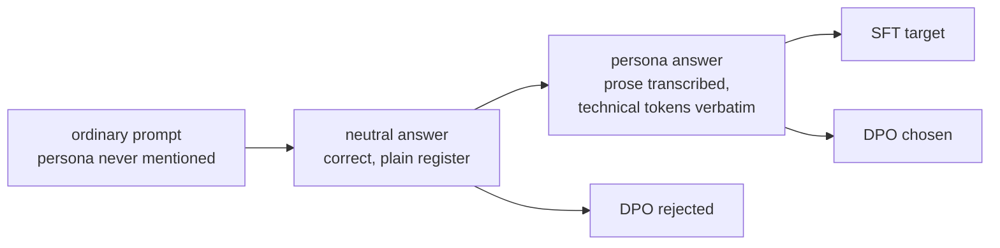

# Unconditional persona adapter — Qwen3.8-27B

## Status and scope

The dataset and the training path exist; the adapter has not yet been trained, converted or
measured. Everything in §9 and §10 is protocol, and §11 is empty until the run happens. Numbers
labelled as projections are projections.

This document owns the **experiment**: what is being measured, how the corpus is stratified to make
the measurement meaningful, the training and conversion configuration, and the evaluation protocol.
It does not own the runtime LoRA mechanism — that is
[`qwen3.8-27b-lora-adapters.md`](qwen3.8-27b-lora-adapters.md) — and it does not repeat the corpus
schema, invariants or authoring provenance, which live in
[`datasets/caveman_pirate/README.md`](../../datasets/caveman_pirate/README.md).

## 1. What this measures

A LoRA adapter's *influence* is usually asserted from the fact that its output differs from the
base. That is a weak claim: §12 of the LoRA reference records a case where "output diverges" held
while the correction was suppressed on the entire prefill path, because divergence only requires the
delta to land somewhere.

A persona that must appear **without being requested** is a much sharper instrument. It is:

- **unambiguous** — a caveman-pirate register either appears or it does not, and
  `datasets/caveman_pirate/score.py` decides it deterministically;
- **first-token visible** — with no system prompt, an in-register reply opens on an interjection,
  and the first token is the argmax of the logits *prefill* produced, so it exercises exactly the
  path the `349240be` defect suppressed;
- **continuously dial-able** — `alpha/r` is folded into `B` at conversion, so one trained adapter
  converts into several banked adapters at different strengths, giving a curve rather than a point.

The deliverable is therefore not "a pirate adapter". It is a **persona-rate against competence-rate
curve as a function of adapter scale**, measured on one process with no reload between arms.

## 2. Unconditional persona is a stratification problem

Ordinary persona SFT teaches `persona <- prompt cue`, which is the opposite of what is wanted. For
the persona to be unconditional it must be independent of every conditioning variable an input can
carry. Two invariants follow, and they drive the entire corpus design:

1. **The persona never appears in any input.** No system prompt, no user turn, ever. If it appears,
   the model learns the cue and the experiment measures nothing. Enforced as invariant I4.
2. **The persona is trained across a distribution of system prompts, not merely their absence.** A
   corpus of only bare prompts leaves any real system prompt out of distribution at serve time, and
   the persona would not fire.

The second point is why the corpus is stratified rather than simply large:

| Stratum | Rows | Share | System message |
|---|---:|---:|---|
| S0 | 422 | 35.2% | none |
| S1 | 364 | 30.3% | generic assistant |
| S2 | 314 | 26.2% | unrelated professional role |
| S3 | 100 | 8.3% | format-constraining (JSON, list, table, length) |

Prompts that explicitly instruct a **contrary** style are deliberately not trained. They are held
back as eval stratum E4. Surviving a prompt the adapter was never taught to defy measures real
influence; training on them would measure a memorized defiance behaviour, and would be narrow
instruction-defiance training of exactly the shape §12 warns about.

## 3. Register and content are separated

The obvious approach — ask for caveman-pirate answers to questions — destroys task competence.
Article-dropping and monosyllabic vocabulary are hostile to arithmetic, code and precise
terminology.

Instead each row carries the same answer twice. `neutral` is the correct ordinary-English answer;
`persona` is that answer with the **prose** transcribed and every technical token copied verbatim:
fenced blocks, inline code, numbers, units, identifiers, URLs. The rule is machine-checked
(invariant I7), so a row that drops a token is rejected rather than silently teaching the model to
be vague.

This also yields the preference pair for free: `chosen` = `persona`, `rejected` = `neutral`, on the
same prompt.



## 4. The scorer

`datasets/caveman_pirate/score.py` is one instrument in three roles — the authoring filter, the
evaluation metric, and a GRPO reward should this ever need RL. `persona_score` returns `[0,1]` from
seven rule sub-scores, with two corrections a plain weighted sum gets wrong:

- **Two multiplicative gates.** Absence of strong pirate markers and absence of an opening
  interjection are *positive evidence* the register is not present, so they scale the score rather
  than contributing an addend. Without them neutral English scores around 0.25, because a neutral
  answer that happens to avoid `you` earns full marks on the pronoun rule for lacking the
  opportunity to break it.
- **A minimum over the core rules.** The register contract is conjunctive. Before this term,
  `Arrr! However, ye must utilize the appropriate configuration, matey.` — articles and latinate
  connectives fully intact — scored exactly 0.750 and would have been admitted at the floor.

Measured separation on the specification's worked examples: worst persona 1.000, best neutral 0.064.

Five scorer defects were found during authoring, every one of which was forcing authors to
**degrade correct content** to pass — drug names dropped from a pet-safety answer, "alias" written
for the correct YAML term "anchor", `A and E` rewritten as "go to hospital". They are recorded with
their fixes in the dataset card. The general lesson is worth keeping: a register filter that scores
the *content* rather than only the prose will quietly trade R11 away for its own thresholds, and it
will do so invisibly, because the corpus still validates.

## 5. Corpus

1,200 training rows over 24 authored cells, 185 held-out evaluation rows over 3. All accepted, zero
rejected. `persona_score` min 0.834, median 1.000. Rendered length median 133, p95 267, max 337
tokens. 100 multi-turn dialogues, expanded to 200 rows so each supervises one assistant turn, with
prior assistant turns already in register — verified 0 mismatches across all 100.

Schema, the nine invariants, the authoring procedure and the near-duplicate and contamination checks
are documented in [`datasets/caveman_pirate/README.md`](../../datasets/caveman_pirate/README.md).

## 6. Why the training file is not a `messages` column

Three facts about this target, in order of decisiveness:

1. `models/Qwen3.8-27B/chat_template.jinja` has **no `` markers** — only
   `add_generation_prompt` at `:163`. `SFTConfig(assistant_only_loss=True)` cannot locate assistant
   spans without them, so it is unusable here. Prompt/completion with `completion_only_loss` is the
   only supported path, not a preference.
2. TRL's conversational branch routes a `messages` column to `Qwen3VLProcessor.apply_chat_template`,
   which expects typed content parts and fails on plain strings.
3. `datasets` is Arrow-backed and infers one schema across the corpus, so an absent key or a varying
   struct shape breaks the load for everything rather than for the offending row.

`train_lora.py --messages-column` therefore renders the message list to a string in-process and
hands TRL `{prompt: str, completion: str}`. Rendering inside the trainer, beside `--thinking`, keeps
one owner for the guarantee that the training surface equals the served surface.

That guarantee is load-bearing here in a way it was not for the math adapter. At
`enable_thinking=True` the template injects a reasoning-effort system message into every prompt
(`:45-46`, `:84-85`), which would give every S0 row a system block and **silently collapse S0 into
S1** — destroying the stratum the headline metric is measured on. At `enable_thinking=False` the
`:84` branch emits nothing and S0 renders with no system block at all. Train and serve closed, or
the corpus design is void.

## 7. Site table and rank

`tools/train/qwen3_8_27b/train_lora.py` now targets the complete registered table unconditionally:

```python
TARGET_MODULES = ["q_proj", "k_proj", "v_proj", "o_proj", "down_proj", "out_proj"]
```

`out_proj` is `linear_attn.out_proj` and it is what makes the table cover the whole model. Only 16
of 64 layers are full attention; the other 48 are Gated DeltaNet. Without it, three quarters of the
model carries `mlp.down_proj` alone. For an edit that must dominate the model's default register,
that is the wrong place to economize.

| | r=16 | **r=32** |
|---|---:|---:|
| Parameters | 42,205,184 | **84,410,368** |
| BF16 size | 84.4 MB | **168.8 MB** |
| Objects | 368 | 368 |
| Fraction of 26.93 B | 0.157% | **0.313%** |

**r=32 is chosen** because the site table structurally excludes `gate_proj` and `up_proj`, so
per-rank capacity here is below a conventional LoRA at equal rank, and because the goal is maximum
influence rather than minimum footprint. The usual "style is low-rank, prefer r=16" argument comes
from mimicking a specific voice from a small real corpus, where rank is memorization capacity and
memorization is a privacy hazard. Neither applies: the corpus is synthetic and the target is a
register, not a person.

**Bank consequence.** Every adapter registered in one engine shares one rank and one site
inventory. An r=32 seven-site pirate adapter cannot be banked beside the existing r=16 six-site
`math` adapter; that adapter must be retrained on the current table to remain co-resident. It is
about 25 minutes and is not on the critical path for this measurement, since the sweep arms and the
base already fill the interesting comparisons.

## 8. Training

```bash
python3 -m tools.train.qwen3_8_27b.train_lora \
  --base models/Qwen3.8-27B \
  --out lora/pirate \
  --dataset json --data-files datasets/caveman_pirate/build/sft.train.jsonl \
  --messages-column messages --completion-column completion \
  --rank 32 --alpha 64 \
  --max-seq-length 512 \
  --steps 274 --batch-size 1 --accumulate 8 \
  --learning-rate 1e-4 --seed 3407
```

| Choice | Value | Rationale |
|---|---|---|
| `max_seq_length` | 512 | The corpus maxes at 337 rendered tokens. 1024 would only buy padding. |
| `steps` | 274 | 1,093 train rows / accum 8 = 137 per epoch, two epochs. |
| `learning_rate` | 1e-4 | Below the 2e-4 default: 1,093 rows is a small corpus and register is easy to fit. Above the 5e-5 small-corpus convention, because the edit must be strong. |
| loss | completion-only | Implied by `--messages-column`; the prompt side is scaffolding. |
| thinking | closed | §6. Must match `ninfer-serve --no-thinking`. |

Projected cost, not measured: the math adapter's 17.9 GiB peak at r=16/6-site/seq-1024 plus roughly
0.4 GB for the larger adapter's gradients and 8-bit optimizer state, so about 18.5 GiB of 24. Step
time should fall well below that run's ~11 s/step, since sequences here are ~150 tokens rather than
1024. Treat the wall-clock as unknown until measured.

## 9. The strength sweep

`convert_lora.py:126` computes `scale = alpha / rank` and folds it into `B` at conversion
(`:285`). There is no runtime scale parameter — but that same property means one trained adapter
converts into several banked adapters at different strengths, with **no code change**: edit
`lora_alpha` in `adapter_config.json` before each conversion.

| Served name | `lora_alpha` | Folded scale | Relative to trained |
|---|---:|---:|---:|
| base | — | — | 0× |
| `qwen3.8-27b-pirate-x05` | 32 | 1.0 | 0.5× |
| `qwen3.8-27b-pirate-x1` | 64 | 2.0 | 1.0× |
| `qwen3.8-27b-pirate-x15` | 96 | 3.0 | 1.5× |
| `qwen3.8-27b-pirate-x2` | 128 | 4.0 | 2.0× |

All four share rank and site inventory, so all four bank together; four of the eight
`kMaximumLoraAdapters` slots remain free.

```bash
ninfer-serve models/qwen3_8_27b.ninfer \
  --lora pirate-x05=lora/pirate-a32.lora.ninfer \
  --lora pirate-x1=lora/pirate-a64.lora.ninfer \
  --lora pirate-x15=lora/pirate-a96.lora.ninfer \
  --lora pirate-x2=lora/pirate-a128.lora.ninfer \
  --no-thinking --greedy \
  --continuation-cache off --no-prefix-reuse \
  --request-log-jsonl profiles/bench/persona.jsonl
```

Five scale points, one process, no reload, selected per request by model id.

The delta scales linearly; behaviour will not. Expect `x2` to degrade, possibly into incoherence.
Locating that breakdown is the point of the sweep, not a failure of it.

## 10. Evaluation protocol

| Stratum | n | What it measures |
|---|---:|---|
| E0 | 30 | **unprompted persona rate — the headline number** |
| E1 | 25 | persona under neutral conditioning |
| E2 | 25 | persona under an unrelated professional role |
| E3 | 20 | persona inside an imposed structure; JSON must still parse |
| **E4** | 25 | **persona against an explicitly contrary style instruction, never trained** |
| C | 25 | competence: exact match on verifiable answers, register-agnostic |
| M | 15 | persona decay across turns |
| EM | 20 | open-ended misalignment probe |

Two baselines, both required:

- **base model, no persona prompt** — the floor; persona rate should be ≈ 0;
- **base model, explicit "speak like a caveman pirate" system prompt** — the ceiling the adapter is
  trying to reach *without* the prompt.

The gap between adapter-E0 and prompted-base is the actual result. Reporting adapter-E0 alone would
overstate the finding, because it says nothing about how much of the register the model already had
available on request.

Per-arm metrics: `persona_score >= 0.75` rate, `competence_check` exact-match rate on C, JSON parse
rate on E3, and the **first-token gate** — with no system prompt, is the first greedy token an
interjection. That gate is cheap, deterministic, and is the only check in the suite that can detect
a prefill-side suppression, which is the failure `349240be` fixed and every prior LoRA test missed.

Measurement hazards, from `performance.md`: the continuation cache must be off and prefix reuse
disabled, or a repeated prompt restores state instead of running; and decoding must be greedy for
arm-to-arm comparability. Read outcomes from the structured request log rather than HTTP timing.

The EM probe is twenty prompts and one run. It is in scope because this deliberately trains
register-independence from prompt conditioning, which is adjacent to the mechanism in the emergent-
misalignment literature, and because a single rank-1 adapter is documented sufficient to induce it.
It is not in scope to expand it into a safety programme.

## 11. Results

Not yet run. The adapter has not been trained.

## 12. Risks and honest expectations

1. **Competence degradation is the expected cost, not a bug.** Technical-token preservation bounds
   it; stratum C measures it. If persona and competence trade off steeply across the sweep, `x1` may
   already be past the useful point.
2. **The base model already knows pirate-speak.** The adapter is mostly removing the *conditioning
   requirement*, not teaching a register. The result is therefore about conditioning strength, and
   the prompted-base ceiling in §10 is what keeps that honest.
3. **The corpus is synthetic and single-origin.** Prompt-side phrasing is more homogeneous than real
   traffic. This limits how far an E0 result generalizes to arbitrary user input.
4. **No runtime scale knob.** Strength is fixed at conversion. The sweep works around this for
   measurement, but a shipped adapter would be committed to one scale.
5. **DPO is built but not wired.** `build/dpo.jsonl` exists with 1,200 pairs; `train_lora.py` is
   SFT-only. Preference training is the escalation if E0/E4 rates come in low, not part of the first
   measurement.
6. **A register filter can silently corrupt a corpus.** Five separate scorer defects each pushed
   authors toward vaguer content while the corpus continued to validate at 100%. The only reason
   they surfaced is that authors reported them. Treat future filter thresholds as capable of the
   same failure.

## 13. Open decisions

1. **`math` adapter retraining** at r=32 on the seven-site table, for co-residency. Not scheduled;
   not needed for the sweep.
2. **The evaluation harness is not written.** §10 specifies the protocol;
   `datasets/caveman_pirate/score.py` provides the metric, but the driver that runs the battery
   across the five arms and both baselines does not exist yet.
3. **S0 cells predate two scorer fixes.** A handful of S0 rows still carry wording routed around the
   proper-noun and capital-letter defects. A targeted repair pass is cheap; whether it is worth
   running before training is unresolved.
4. **Sweep spacing.** `{0.5, 1, 1.5, 2}×` is a guess at where the interesting behaviour sits. If
   `x2` is coherent, the range should extend rather than subdivide.
